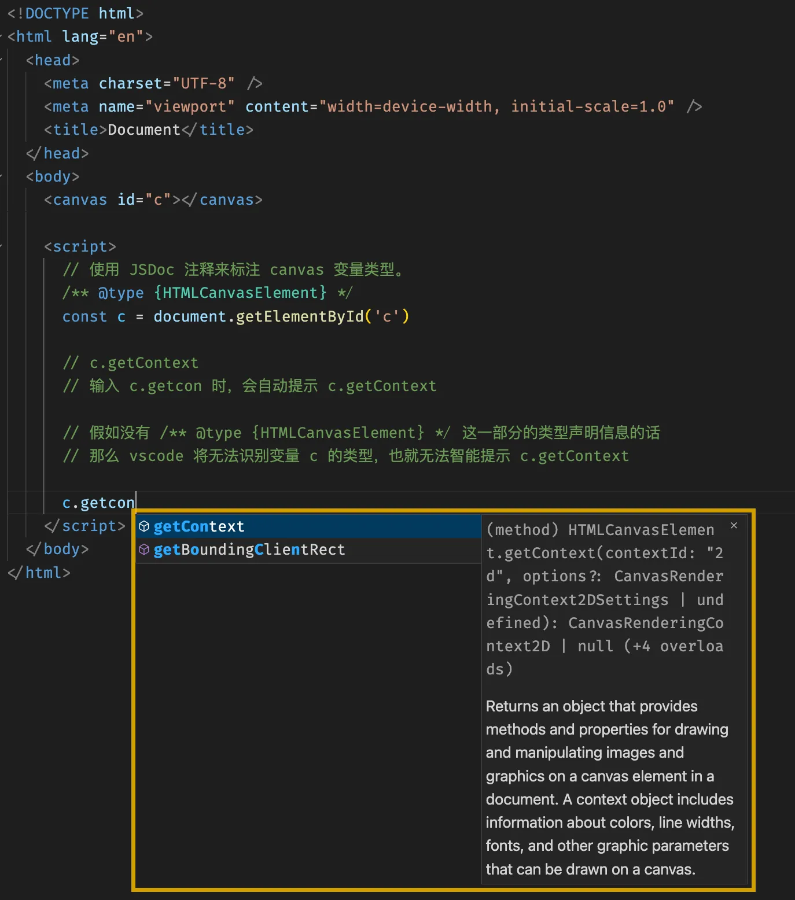
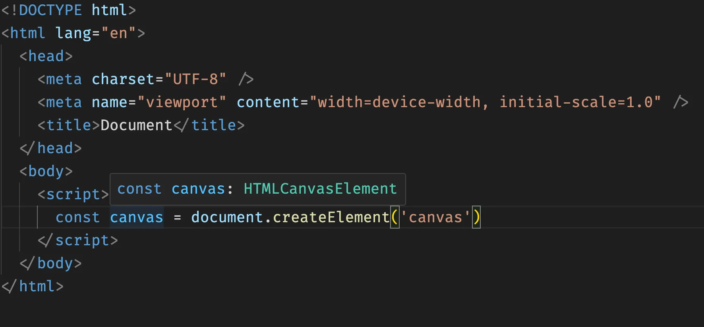
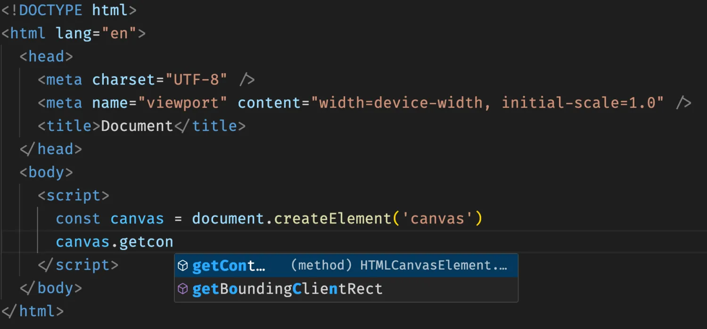

# [0006. 使用 JSDoc 来标注 canvas 变量类型](https://github.com/Tdahuyou/canvas/tree/main/0006.%20%E4%BD%BF%E7%94%A8%20JSDoc%20%E6%9D%A5%E6%A0%87%E6%B3%A8%20canvas%20%E5%8F%98%E9%87%8F%E7%B1%BB%E5%9E%8B)

<!-- region:toc -->

<!-- endregion:toc -->

## 1. 📝 Summary

本节介绍的内容是 —— 如何在 IDE 中获取更友好地 canvas 相关的 API 智能提示问题。
- 【示例 2】如果想要获取到 IDE 的智能提示，有些教程中的做法是推荐你使用 createElement 的方式来创建 canvas，这么做的目的是为了获取到更有好的智能提示。
- 【示例 1】而如果你页面上如果已经有了 canvas 标签，然后你通过查询的方式找到这个标签，此时默认是没有智能提示的，这个问题可以通过 JSDoc 标注的方式来解决。

## 2. 💻 demo1 - 查询已有的 canvas

```html
<!-- 1.html -->
<!DOCTYPE html>
<html lang="en">
  <head>
    <meta charset="UTF-8" />
    <meta name="viewport" content="width=device-width, initial-scale=1.0" />
    <title>Document</title>
  </head>
  <body>
    <canvas id="c"></canvas>

    <script>
      // 使用 JSDoc 注释来标注 canvas 变量类型。
      /** @type {HTMLCanvasElement} */
      const c = document.getElementById('c')

      // c.getContext
      // 输入 c.getcon 时，会自动提示 c.getContext

      // 假如没有 /** @type {HTMLCanvasElement} */ 这一部分的类型声明信息的话
      // 那么 vscode 将无法识别变量 c 的类型，也就无法智能提示 c.getContext
    </script>
  </body>
</html>
```



## 3. 💻 demo2 - 创建新的 canvas

```html
<!-- 2.thml -->
<!DOCTYPE html>
<html lang="en">
  <head>
    <meta charset="UTF-8" />
    <meta name="viewport" content="width=device-width, initial-scale=1.0" />
    <title>Document</title>
  </head>
  <body>
    <script>
      // 如果是通过 createElement 的方式来创建一个 canvas 的话，那么 IDE 是能够给我们提示的。
      // 因为 IDE 能够识别出 canvas 变量的类型是 HTMLCanvasElement
      const canvas = document.createElement('canvas')
      const ctx = canvas.getContext('2d')
    </script>
  </body>
</html>
```



此时 IDE 能够推断出 canvas 变量的类型，因此它能够非常智能地给予咱们提示。

比如，你输入 `canvas.getcon` 就会提示出对应的 API，此时直接按下 tap 或者回车键，即可快速生成内容。

