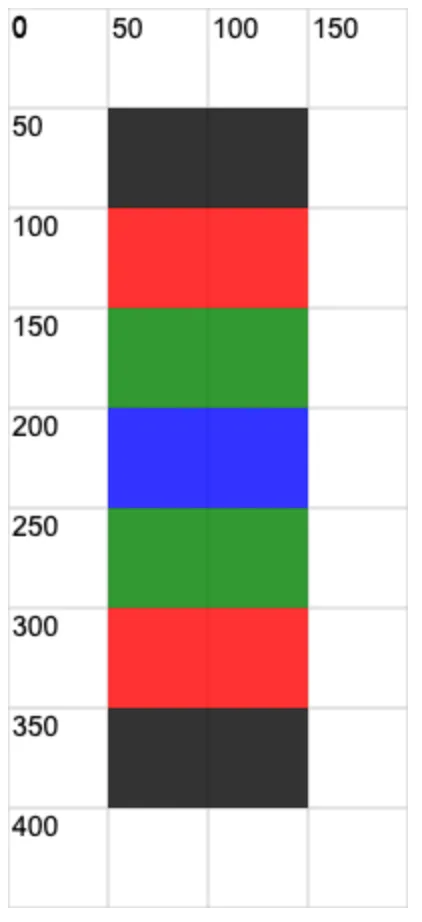

# [0007. 使用 ctx.save 和 ctx.restore 保存和恢复画布状态](https://github.com/Tdahuyou/canvas/tree/main/0007.%20%E4%BD%BF%E7%94%A8%20ctx.save%20%E5%92%8C%20ctx.restore%20%E4%BF%9D%E5%AD%98%E5%92%8C%E6%81%A2%E5%A4%8D%E7%94%BB%E5%B8%83%E7%8A%B6%E6%80%81)

<!-- region:toc -->
- [1. 📝 Summary](#1--summary)
- [2. 📒 notes](#2--notes)
  - [2.1. `ctx.save` 和 `ctx.restore` 使用场景](#21-ctxsave-和-ctxrestore-使用场景)
  - [2.2. `ctx.save()`](#22-ctxsave())
  - [2.3. ctx.restore()](#23-ctxrestore())
  - [2.4. 常见用法：存 - 改 - 复原](#24-常见用法存---改---复原)
- [3. 💻 demo](#3--demo)
<!-- endregion:toc -->

## 1. 📝 Summary

画笔状态的存储和恢复还是比较常见的操作，需要掌握一些常见的写法。

## 2. 📒 notes

[ctx.save()](https://developer.mozilla.org/zh-CN/docs/Web/API/CanvasRenderingContext2D/save) 和 [ctx.restore()](https://developer.mozilla.org/zh-CN/docs/Web/API/CanvasRenderingContext2D/restore) 方法用于保存和恢复画布（Canvas）的状态。

### 2.1. `ctx.save` 和 `ctx.restore` 使用场景

在你需要暂时改变绘图样式、变换或者路径，而后又想恢复到之前状态的情况下特别有用。

### 2.2. `ctx.save()`

这个方法用于保存当前画布的所有状态。

这里说的状态，包括：

- 描边样式 `ctx.strokeStyle`
- 填充样式 `ctx.fillStyle`
- 线条样式 `ctx.lineWidth`
- 文本样式 `ctx.font`
- 裁剪 `ctx.clip`
- ……

### 2.3. ctx.restore()

这个方法用于恢复 **最近一次** 通过 `ctx.save()` 保存的画布状态。

你可以调用多次 `ctx.save()` 来保存多个状态，并按照栈的后进先出（LIFO）顺序通过 `ctx.restore()` 来恢复这些状态。

### 2.4. 常见用法：存 - 改 - 复原

```javascript
const canvas = document.createElement('canvas')
onst ctx = canvas.getContext('2d')

// ……

function draw1() {
  // 第一步 存下当前的画笔状态
  ctx.save()

  // 第二步 修改画笔状态，绘制图形
  // ……

  // 第三步 重置回第一步的画笔状态
  ctx.restore()
}

function draw2() {
  // 第一步 存下当前的画笔状态
  ctx.save()

  // 第二步 修改画笔状态，绘制图形
  // ……

  // 第三步 重置回第一步的画笔状态
  ctx.restore()
}
```

在每个绘图的方法中，我们可能会需要调整画笔的状态，比如改变一些描边的粗细、颜色等等，但是这些信息的修改我们希望是局部的，不要对全局造成影响。此时，就可以使用上述这种做法来管理画笔的状态。

1. 在绘图之前，暂存画笔开始状态信息。`ctx.store()`
2. 自定义画笔状态来实现绘图。
3. 本次绘制逻辑结束，恢复画笔到开始状态。`ctx.restore()`

## 3. 💻 demo

```html
<!-- 1.html -->
<!DOCTYPE html>
<html lang="en">
  <head>
    <meta charset="UTF-8" />
    <meta http-equiv="X-UA-Compatible" content="IE=edge" />
    <meta name="viewport" content="width=device-width, initial-scale=1.0" />
    <title>Document</title>
  </head>
  <body>
    <script src="./drawGrid.js"></script>
    <script>
      const canvas = document.createElement('canvas')
      drawGrid(canvas, 200, 450, 50)
      document.body.append(canvas)
      const ctx = canvas.getContext('2d')

      ctx.beginPath()
      ctx.globalAlpha = .8

      ctx.fillRect(50, 50, 100, 50)

      ctx.save() // 保存初始状态【黑色填充】

      ctx.fillStyle = 'red'
      ctx.fillRect(50, 100, 100, 50)

      ctx.save() // 保存状态 1【红色填充】

      ctx.fillStyle = 'green'
      ctx.fillRect(50, 150, 100, 50)

      ctx.save() // 保存状态 2【绿色填充】

      ctx.fillStyle = 'blue'
      ctx.fillRect(50, 200, 100, 50)

      ctx.restore()
      // 恢复到最近一次保存的状态，也就是状态 2，此时的填充颜色为绿色
      ctx.fillRect(50, 250, 100, 50)

      ctx.restore()
      // 再次恢复到最近一次保存的状态，也就是状态 1，此时的填充颜色为红色
      ctx.fillRect(50,  300, 100, 50)

      ctx.restore()
      // 再次恢复到最近一次保存的状态，也就是初始状态，此时的填充颜色为黑色
      ctx.fillRect(50,  350, 100, 50)
    </script>
  </body>
</html>
```

