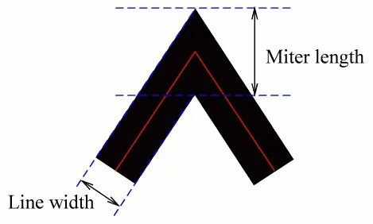
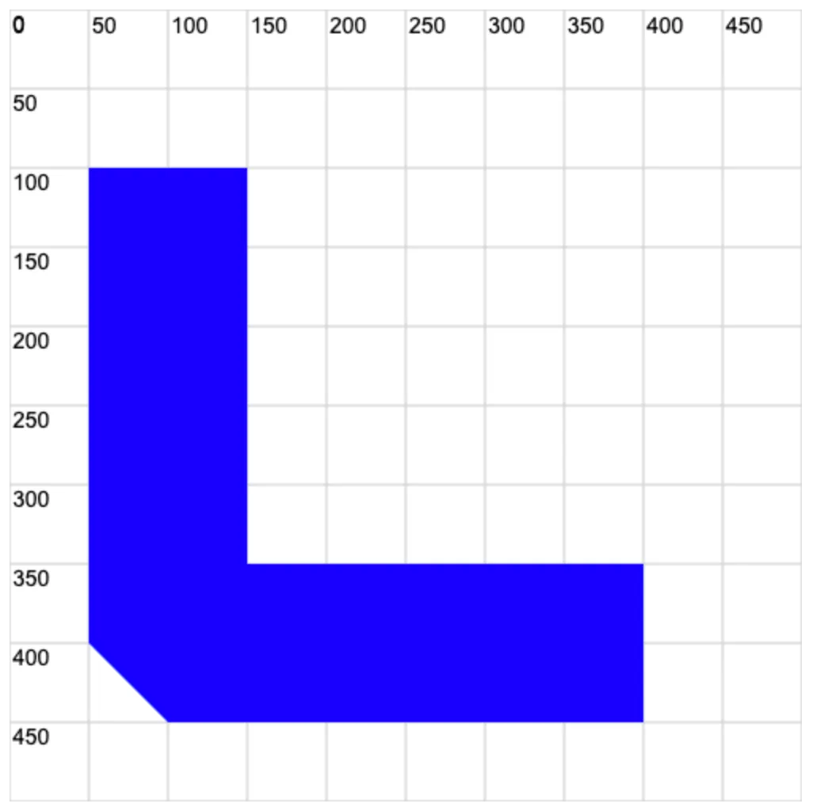

# [0011. 使用 ctx.miterLimit 约束两线相交处的最大倾斜长度](https://github.com/Tdahuyou/canvas/tree/main/0011.%20%E4%BD%BF%E7%94%A8%20ctx.miterLimit%20%E7%BA%A6%E6%9D%9F%E4%B8%A4%E7%BA%BF%E7%9B%B8%E4%BA%A4%E5%A4%84%E7%9A%84%E6%9C%80%E5%A4%A7%E5%80%BE%E6%96%9C%E9%95%BF%E5%BA%A6)


## 📒 notes

本节介绍的内容，和下面这个公式有关。

$$
\text{miterLimit} = \frac{\text{miterLength（斜接长度）}}{\text{lineWidth（线条宽度）}}
$$

通过下面这张图，认识 lineWidth、miterLength 表示的分别是哪部分的尺寸。



## 💻 demo1

```html
<!-- 1.html -->
 <!DOCTYPE html>
<html lang="en">
  <head>
    <meta charset="UTF-8" />
    <meta name="viewport" content="width=device-width, initial-scale=1.0" />
    <title>demo</title>
  </head>
  <body>
    <script src="./drawGrid.js"></script>
    <script>
      const cavnas = document.createElement('canvas')
      cavnas.width = 500
      cavnas.height = 500
      document.body.appendChild(cavnas)

      drawGrid(cavnas, 500, 500, 50)
      const ctx = cavnas.getContext('2d')
      ctx.beginPath()

      /*
      MDN doc:
      https://developer.mozilla.org/zh-CN/docs/Web/API/CanvasRenderingContext2D/miterLimit

      ctx.miterLimit 是 HTML5 Canvas 2D API 中的一个属性，用于设置或返回当两条线相交时接合处的最大斜接长度（miter length）。
      斜接长度是指在两条线相交形成尖角时，内角顶点到外角顶点的距离。
      这个属性主要用于控制具有 miter 接合类型的线条边角的外观。


      场景：
      当线条比较粗，折线夹角比较小的时候，lineJoin 的 miter 设置形成的尖会比较长。
      如果角度非常尖锐，斜接长度可能会异常长，导致图形显示不理想。
      这时候可以利用该属性来控制尖角的长短。
      miterLimit 属性允许你设置一个限制值，超过这个值的斜接长度会自动转换为 bevel 类型的接合，即切去尖角部分。


      参数：
      miterLimit: 这个值是一个大于等于 1 的数字。它表示允许的最大斜接长度与线条宽度的比率。默认值通常是 10。
      如果斜接长度超过 miterLimit 的值，边角会以 lineJoin 的 " ] " 类型来显示


      效果：
      当 miterLimit 设置得较小，如接近于 1 时，只要相交角稍微尖锐一点，接合方式就会从 miter 转为 bevel。
      当 miterLimit 设置得较大时，即使是非常尖锐的角，接合处也会尝试保持 miter 类型，可能导致角部分非常尖长。

      小结：
      角可以尖、可以长，但是得有个度。
      这个度就是 miterLimit。
      miterLimit = miterLength / lineWidth

      1️⃣ miterLength / lineWidth 这玩意儿用于表示角的尖锐程度。【角实际的尖锐程度】
      2️⃣ miterLimit 这玩意儿用于设置一个阈值。【允许的最大尖锐程度】

      如果 1️⃣ 大于 2️⃣，那么就会把尖角切掉，变成 bevel 类型。
        表示角太尖了，得切掉，变为平角。
      如果 1️⃣ 小于 2️⃣，那么就会保持 miter 类型。
        表示角还不够尖，不需要切。
      */

      ctx.lineWidth = 20
      ctx.lineJoin = 'miter'
      ctx.strokeStyle = 'blue'

      ctx.moveTo(100, 100)
      ctx.lineTo(150, 400)
      ctx.lineTo(200, 100)
      ctx.stroke()

      ctx.beginPath()
      ctx.moveTo(300, 100)
      ctx.lineTo(350, 400)
      ctx.lineTo(400, 100)

      ctx.miterLimit = 6 // 2️⃣
      // 此时 lineWidth 是 20
      // 视觉评估：此时 miterLength 大概在 120 到 140 之间
      // 即 1️⃣ 的值大概在 6～7 之间
      // 也就是说如果 miterLimit 在 1 到 6 之间，那么这个尖角就会被切为平角。1️⃣ 大于 2️⃣
      // 如果 miterLimit 大于等于 7，那么这个尖角就不会被切为平角。1️⃣ 小于 2️⃣
      // 验证：
      // 改变 miterLimit 从 1 到 6 时，比例还未达到这个示例中的临界点，因此它们都显示为斜接（miter）样式。
      // 设置为 7 时，这个值刚好超过了斜接长度与线宽比例的限制，导致连接样式从斜接（miter）转为斜角（bevel）。
      ctx.stroke()
    </script>
  </body>
</html>
```


## 💻 demo2

```html
<!-- 2.html -->
<!DOCTYPE html>
<html lang="en">
  <head>
    <meta charset="UTF-8" />
    <meta name="viewport" content="width=device-width, initial-scale=1.0" />
    <title>demo</title>
  </head>
  <body>
    <script src="./drawGrid.js"></script>
    <script>
      const cavnas = document.createElement('canvas')
      cavnas.width = 500
      cavnas.height = 500
      document.body.appendChild(cavnas)

      drawGrid(cavnas, 500, 500, 50)
      const ctx = cavnas.getContext('2d')
      ctx.beginPath()

      ctx.lineWidth = 100
      ctx.lineJoin = 'miter'
      ctx.strokeStyle = 'blue'

      ctx.moveTo(100, 100)
      ctx.lineTo(100, 400)
      ctx.lineTo(400, 400)
      ctx.miterLimit = Math.sqrt(2)
      ctx.stroke()

      /*
      上面描述了一种特殊的情况，此时 miterLength 比较好计算
      lineWidth = 100
      miterLength = Math.sqrt(lineWidth^2 + lineWidth^2)
      miterLimit = miterLength / lineWidth = Math.sqrt(2)

      现在是否要将尖角切为平角，就看我们设置的 miterLimit 的阈值是多少了。
      miterLimit 值越大 -> 尖角越尖
      如果你觉得这个角太尖了，要切为平角，那么 miterLimit 设置的比 Math.sqrt(2) 小就可以了。
      如果你觉得这个角不会太尖，不需要切，那么 miterLimit 设置的比 Math.sqrt(2) 大就可以了。
        默认值是 10，所以默认情况下，不会切角。
      */
    </script>
  </body>
</html>
```


