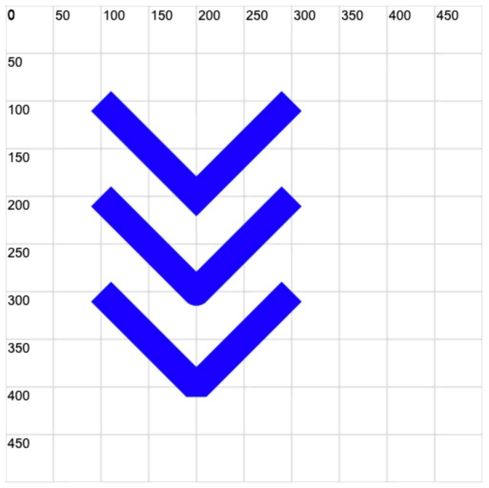

# 0013. 使用 ctx.lineJoin 设置线条连接处的样式

## 📝 notes

学会使用 `ctx.lineJoin` 设置线条连接处的样式。
- miter `>` 尖角
- round `)` 圆角
- bevel `]` 平角

**单词**
- miter，尖角
- bevel，平角、斜角

## 💻 demo

```html
<!-- 1.html -->
 <!DOCTYPE html>
<html lang="en">
  <head>
    <meta charset="UTF-8" />
    <meta name="viewport" content="width=device-width, initial-scale=1.0" />
    <title>demo</title>
  </head>
  <body>
    <script src="./drawGrid.js"></script>
    <script>
      const cavnas = document.createElement('canvas')
      cavnas.width = 500
      cavnas.height = 500
      document.body.appendChild(cavnas)

      drawGrid(cavnas, 500, 500, 50)
      const ctx = cavnas.getContext('2d')
      ctx.beginPath()

      ctx.lineWidth = 30
      ctx.strokeStyle = 'blue'

      // miter   >
      // round   )
      // bevel   ]

      ctx.lineJoin = 'miter' // 尖的（默认）
      ctx.beginPath()
      ctx.moveTo(100, 100)
      ctx.lineTo(200, 200)
      ctx.lineTo(300, 100)
      ctx.stroke()

      ctx.lineJoin = 'round' // 圆的
      ctx.beginPath()
      ctx.moveTo(100, 200)
      ctx.lineTo(200, 300)
      ctx.lineTo(300, 200)
      ctx.stroke()

      ctx.lineJoin = 'bevel' // 平的（斜角）
      ctx.beginPath()
      ctx.moveTo(100, 300)
      ctx.lineTo(200, 400)
      ctx.lineTo(300, 300)
      ctx.stroke()
    </script>
  </body>
</html>
```


