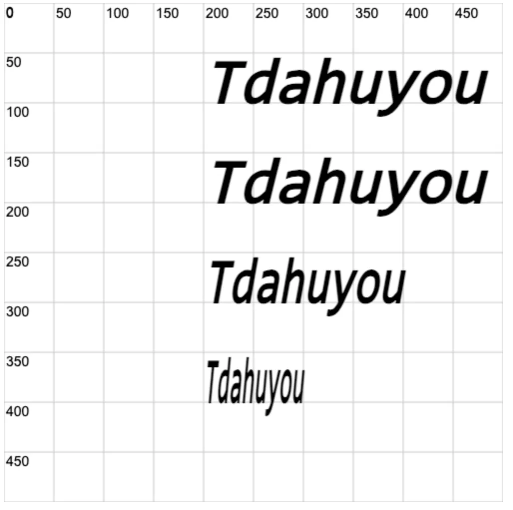

# 0014. 使用 ctx.fillText、ctx.strokeText 绘制文本

## 📝 notes

`ctx.fillText` 绘制填充文本。

`ctx.strokeText` 绘制描边文本。

最多可以接收 4 个参数，分别表示：
1. 文本内容
2. 文本的横坐标
3. 文本的纵坐标
4. 文本的总宽度

## 💻 demo1

```html
<!-- 1.html -->
<!DOCTYPE html>
<html lang="en">
  <head>
    <meta charset="UTF-8" />
    <meta name="viewport" content="width=device-width, initial-scale=1.0" />
    <title>绘制填充文本</title>
  </head>
  <body>
    <script src="./drawGrid.js"></script>
    <script>
      const cavnas = document.createElement('canvas')
      drawGrid(cavnas, 500, 500, 50)
      document.body.appendChild(cavnas)
      const ctx = cavnas.getContext('2d')

      ctx.font = 'bold italic 4rem sans-serif'

      // ctx.fillText(text, x, y[, maxWidth])
      // 用于在画布上绘制填充的文本。

      // text 要绘制的字符串。
      // x y 文本起始点的坐标（相对于 Canvas 画布）。
      // maxWidth 这是一个可选参数，表示文本的最大允许宽度。
      // 如果设置了 maxWidth，文本将在必要时被缩放或压缩以适应这个宽度。

      ctx.fillText('Tdahuyou', 200, 200)
      // 'Tdahuyou'   表示要绘制的文本
      // 200          表示文本的 x 坐标
      // 200          表示文本的 y 坐标
    </script>
  </body>
</html>
```


## 💻 demo2

```html
<!-- 2.html -->
<!DOCTYPE html>
<html lang="en">
  <head>
    <meta charset="UTF-8" />
    <meta name="viewport" content="width=device-width, initial-scale=1.0" />
    <title>文本的最大宽度</title>
  </head>
  <body>
    <script src="./drawGrid.js"></script>
    <script>
      const cavnas = document.createElement('canvas')
      drawGrid(cavnas, 500, 500, 50)
      document.body.appendChild(cavnas)
      const ctx = cavnas.getContext('2d')

      ctx.font = 'bold italic 4rem sans-serif'
      ctx.fillText('Tdahuyou', 200, 100)

      ctx.fillText('Tdahuyou', 200, 200, 300)
      // 文本最大宽度为 300（此时文本不会被压缩，因为最大宽度足够。）

      ctx.fillText('Tdahuyou', 200, 300, 200)
      // 文本最大宽度为 200（此时文本会被压缩，往起始点方向压缩。）

      ctx.fillText('Tdahuyou', 200, 400, 100)
      // 文本最大宽度为 400（此时文本会被压缩，往起始点方向压缩。）
    </script>
  </body>
</html>
```



## 💻 demo3

```html
<!-- 3.html -->
<!DOCTYPE html>
<html lang="en">
  <head>
    <meta charset="UTF-8" />
    <meta name="viewport" content="width=device-width, initial-scale=1.0" />
    <title>描边文本</title>
  </head>
  <body>
    <script src="./drawGrid.js"></script>
    <script>
      const cavnas = document.createElement('canvas')
      drawGrid(cavnas, 500, 500, 50)
      document.body.appendChild(cavnas)

      const ctx = cavnas.getContext('2d')

      ctx.font = 'bold italic 4rem sans-serif'
      ctx.fillText('Tdahuyou', 200, 200)
      ctx.strokeText('Tdahuyou', 200, 300)

      // ctx.strokeText(text, x, y[, maxWidth])
      // 用于绘制描边文本。

      // 对比 ctx.fillText、ctx.strokeText 两个绘制文本的方法。
      // 相同点：都是用于在画布上绘制文本，并且参数都是一样的。
      // 不同点：fillText 绘制的文本是实心的，strokeText 绘制的文本是空心的。
    </script>
  </body>
</html>
```


