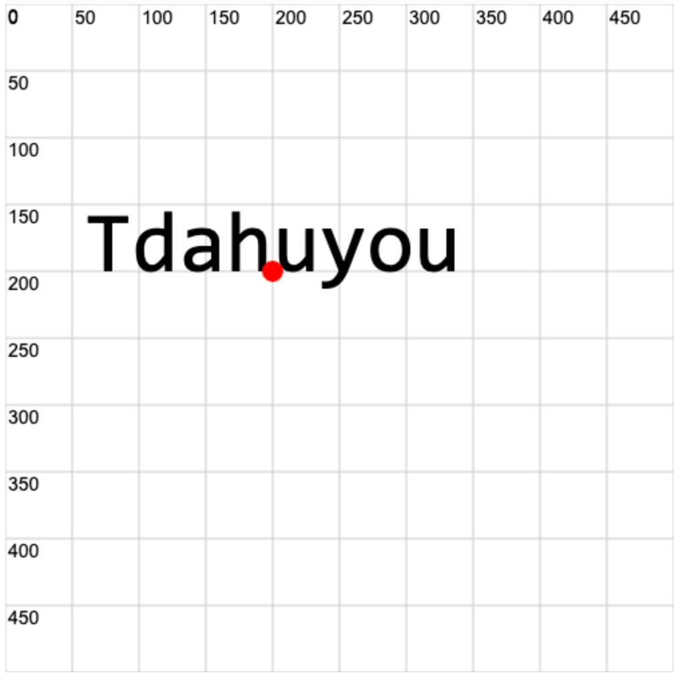
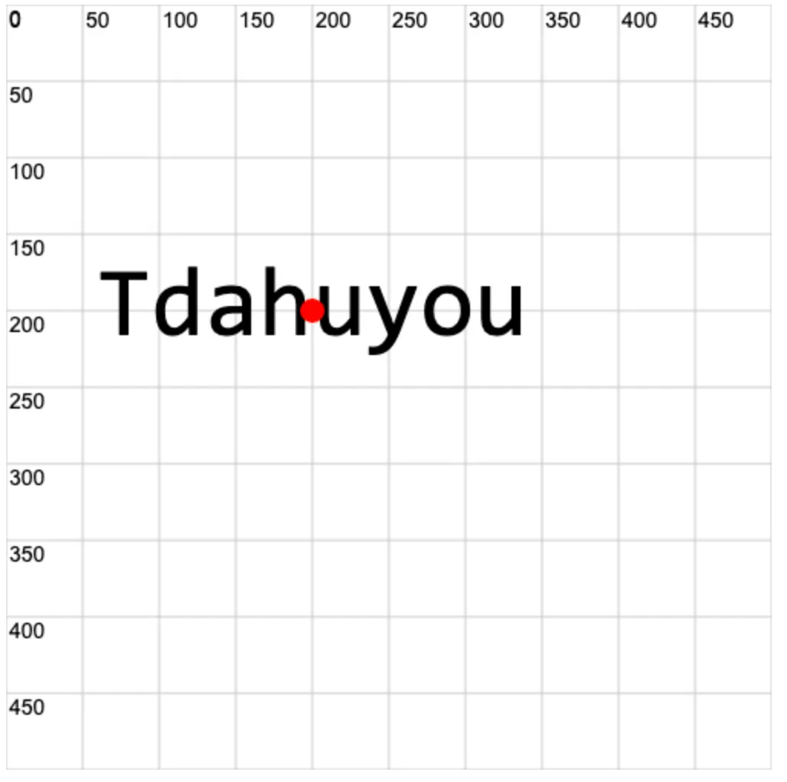

# 0016. 使用 ctx.textBaseline、ctx.textAlign 设置文本对齐方式

- ctx.textBaseline 设置文本的 **垂直** 对齐方式
- ctx.textAlign 设置文本的 **水平** 对齐方式

## 🔗 links

- https://developer.mozilla.org/en-US/docs/Web/API/CanvasRenderingContext2D/textBaseline - MDN，textBaseline 设置文本的 垂直 对齐方式。
- https://developer.mozilla.org/en-US/docs/Web/API/CanvasRenderingContext2D/textAlign - MDN，textAlign 设置文本的 水平 对齐方式。


## 💻 demo1

```html
<!-- 1.html -->
<!DOCTYPE html>
<html lang="en">
  <head>
    <meta charset="UTF-8" />
    <meta name="viewport" content="width=device-width, initial-scale=1.0" />
    <title>ctx.textAlign</title>
  </head>
  <body>
    <script src="./drawGrid.js"></script>
    <script>
      const cavnas = document.createElement('canvas')
      drawGrid(cavnas, 500, 500, 50)
      document.body.appendChild(cavnas)
      const ctx = cavnas.getContext('2d')

      // MDN DOC textAlign
      // https://developer.mozilla.org/en-US/docs/Web/API/CanvasRenderingContext2D/textAlign

      // ctx.textAlign 属性用于设置文本基于锚点的水平位置。

      // 常用属性值：
      // left   文本在锚点的左侧
      // right  文本在锚点的右侧
      // center 文本在锚点的中心

      ctx.textAlign = 'center' // 水平居中对齐

      ctx.font = '4rem sans-serif'
      ctx.fillText('Tdahuyou', 200, 200)

      // 锚点
      ctx.beginPath()
      ctx.fillStyle = 'red'
      ctx.arc(200, 200, 8, 0, Math.PI * 2)
      ctx.fill()
    </script>
  </body>
</html>
```



## 💻 demo2

```html
<!-- 2.html -->
<!DOCTYPE html>
<html lang="en">
  <head>
    <meta charset="UTF-8" />
    <meta name="viewport" content="width=device-width, initial-scale=1.0" />
    <title>ctx.textBaseline</title>
  </head>
  <body>
    <script src="./drawGrid.js"></script>
    <script>
      const cavnas = document.createElement('canvas')
      drawGrid(cavnas, 500, 500, 50)
      document.body.appendChild(cavnas)
      const ctx = cavnas.getContext('2d')

      // MDN DOC textBaseline
      // https://developer.mozilla.org/en-US/docs/Web/API/CanvasRenderingContext2D/textBaseline

      // ctx.textBaseline 属性用于设置文本基于锚点的垂直位置。

      // 常用属性值：
      // top    文本的顶部与指定的 y 坐标对齐。
      // middle 文本的中点与指定的 y 坐标对齐。
      // bottom 文本的底部与指定的 y 坐标对齐。

      ctx.textBaseline = 'middle' // 垂直居中对齐
     ctx.textAlign = 'center' // 水平居中对齐

      ctx.font = '4rem sans-serif'
      ctx.fillText('Tdahuyou', 200, 200)

      // 锚点
      ctx.beginPath()
      ctx.fillStyle = 'red'
      ctx.arc(200, 200, 8, 0, Math.PI * 2)
      ctx.fill()
    </script>
  </body>
</html>
```


