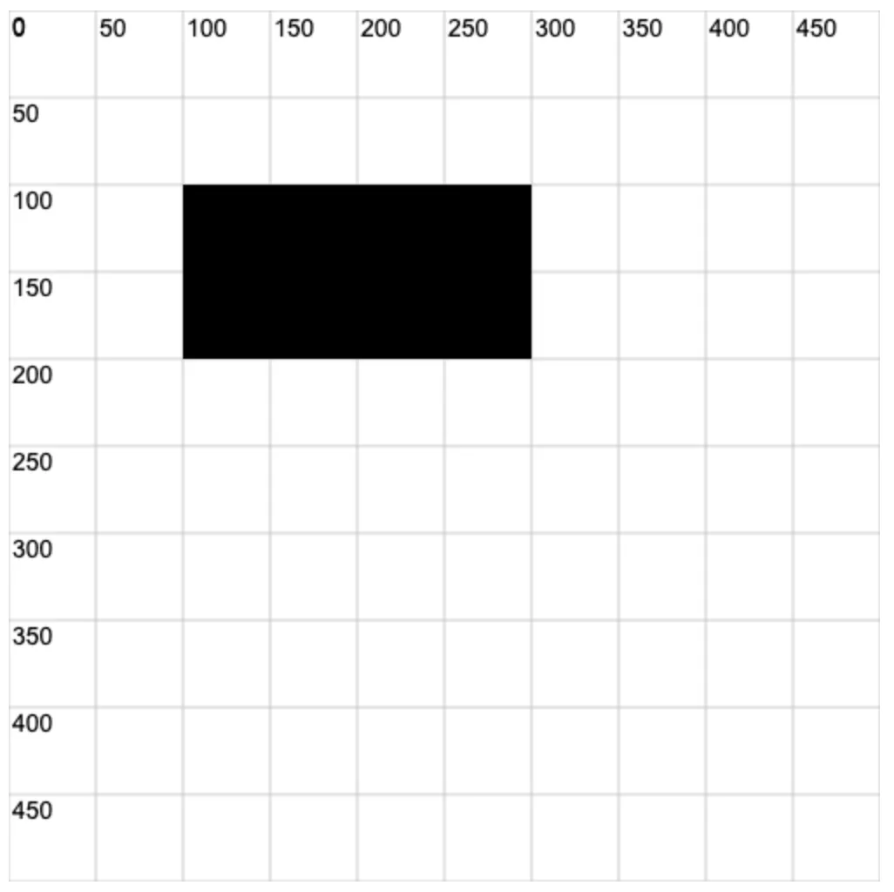

# 0017. 绘制网格

## 📝 notes

做一个可视化的网格，作为参考坐标系，以便更直观地查看坐标，主要是辅助学习用。
> 其中 `drawGrid.js` 用到的一些知识点，在其它文档中会介绍。

---

**封装 drawGrid**

```js
// drawGrid.js
/**
 * 绘制网格
 * @param {HTMLCanvasElement} canvas 画布元素
 * @param {Number} width 画布宽度
 * @param {Number} height 画布高度
 * @param {Number} cellSize 网格单元格尺寸
 * @param {Number} opacity 网格线透明度
 * @param {Number} fontSize 网格坐标刻度的文字大小
 */
function drawGrid(canvas, width = 500, height = 500, cellSize = 50, opacity = 0.2, fontSize = 14) {
  const ctx = canvas.getContext('2d')

  canvas.width = width // 设置画布大小（注意：这会重置画布状态）
  canvas.height = height

  ctx.save() // 保存当前的绘图状态（注意：ctx.save 的调用，要放在设置 width、height 之后。）

  ctx.strokeStyle = `rgba(0, 0, 0, ${opacity})`
  ctx.font = `${fontSize}px Arial`

  // 开始绘制网格线
  ctx.beginPath()
  for (let x = 0; x <= width; x += cellSize) {
    ctx.moveTo(x, 0)
    ctx.lineTo(x, height)
    ctx.fillText(x.toString(), x + 2, 15) // 绘制文字
  }
  for (let y = 0; y <= height; y += cellSize) {
    ctx.moveTo(0, y)
    ctx.lineTo(width, y)
    ctx.fillText(y.toString(), 2, y + 14) // 绘制文字
  }
  ctx.stroke() // 应用之前的设置绘制线条

  ctx.restore() // 恢复保存的绘图状态
}
```

`drawGrid.js` 用到的一些知识点，在后续文档中会介绍。

这里提前将其丢到这里来介绍，是为了给后续内容做一个铺垫，将不可见的坐标可视化地绘制出来，参考着可视化的坐标来学习，效果也许会更好。毕竟类似 canvas 和 svg 这类的可视化技术，无时无刻不在跟不可见的坐标系打交道。


## 💻 demo1

```html
<!-- 1.html -->
<!DOCTYPE html>
<html lang="en">
  <head>
    <meta charset="UTF-8" />
    <meta name="viewport" content="width=device-width, initial-scale=1.0" />
    <title>Document</title>
  </head>
  <body>
    <script src="./drawGrid.js"></script>
    <script>
      const cavnas = document.createElement('canvas')

      // 创建好 canvas 之后，直接调用 drawGrid 函数绘制参考网格。
      drawGrid(cavnas, 500, 500, 50)
      // 表示绘制一个 500 * 500 的网格，每个网格的尺寸是 50。

      document.body.appendChild(cavnas)
      const ctx = cavnas.getContext('2d')
      ctx.beginPath() // 路径分组，以防后续的绘制操作影响到之前绘制的网格。
    </script>
  </body>
</html>
```


## 💻 demo2

```html
<!-- 2.html -->
<!DOCTYPE html>
<html lang="en">
  <head>
    <meta charset="UTF-8" />
    <meta name="viewport" content="width=device-width, initial-scale=1.0" />
    <title>Document</title>
  </head>
  <body>
    <script src="./drawGrid.js"></script>
    <script>
      const cavnas = document.createElement('canvas')
      drawGrid(cavnas, 500, 500, 50)
      document.body.appendChild(cavnas)
      const ctx = cavnas.getContext('2d')
      ctx.beginPath()

      // 前面的 canvas 画布初始化逻辑基本不会变化，在接下来的学习中直接搬运即可。
      // 后续如果要学习绘制新的图形，直接接着写往后写就行。
      // 前面绘制的网格，主要作为参考坐标系，以便更直观地查看坐标。
      ctx.fillRect(100, 100, 200, 100)
    </script>
  </body>
</html>
```

