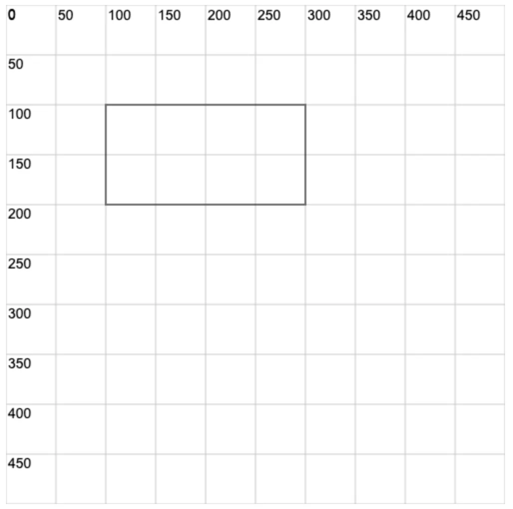

# 0019. 使用 ctx.strokeRect 绘制矩形

## 📝 notes

学会使用 `ctx.strokeRect()` 来绘制一个描边矩形。

## 💻 demo1

```html
<!-- 1.html -->
<!DOCTYPE html>
<html lang="en">
  <head>
    <meta charset="UTF-8" />
    <meta name="viewport" content="width=device-width, initial-scale=1.0" />
    <title>Document</title>
  </head>
  <body>
    <script src="./drawGrid.js"></script>
    <script>
      const cavnas = document.createElement('canvas')
      drawGrid(cavnas, 500, 500, 50)
      document.body.appendChild(cavnas)
      const ctx = cavnas.getContext('2d')
      ctx.beginPath()

      ctx.strokeRect(100, 100, 200, 100)
      // 100 100 表示矩形左上角的 x y 坐标
      // 200 100 表示矩形的宽高
      // 该方法绘制的是一个矩形边框（也称描边矩形）
      // 描边的颜色默认为黑色
    </script>
  </body>
</html>
```

