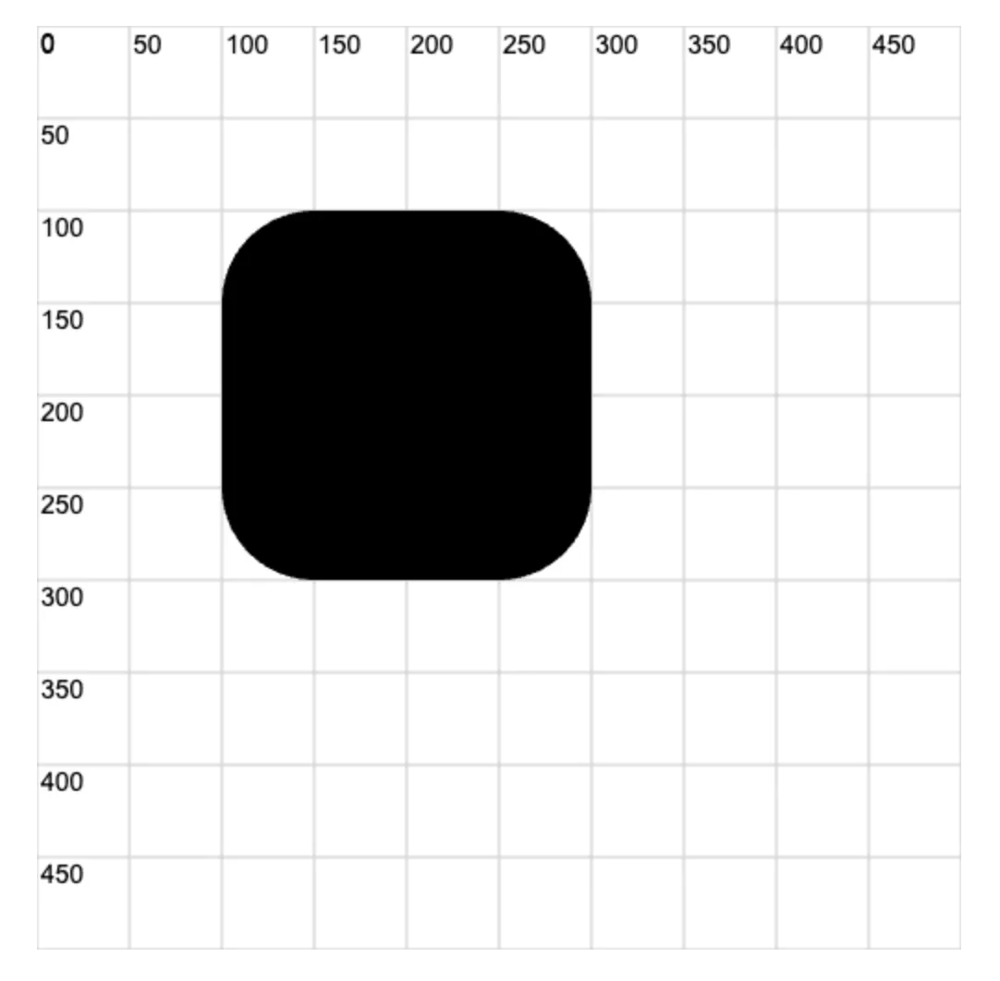
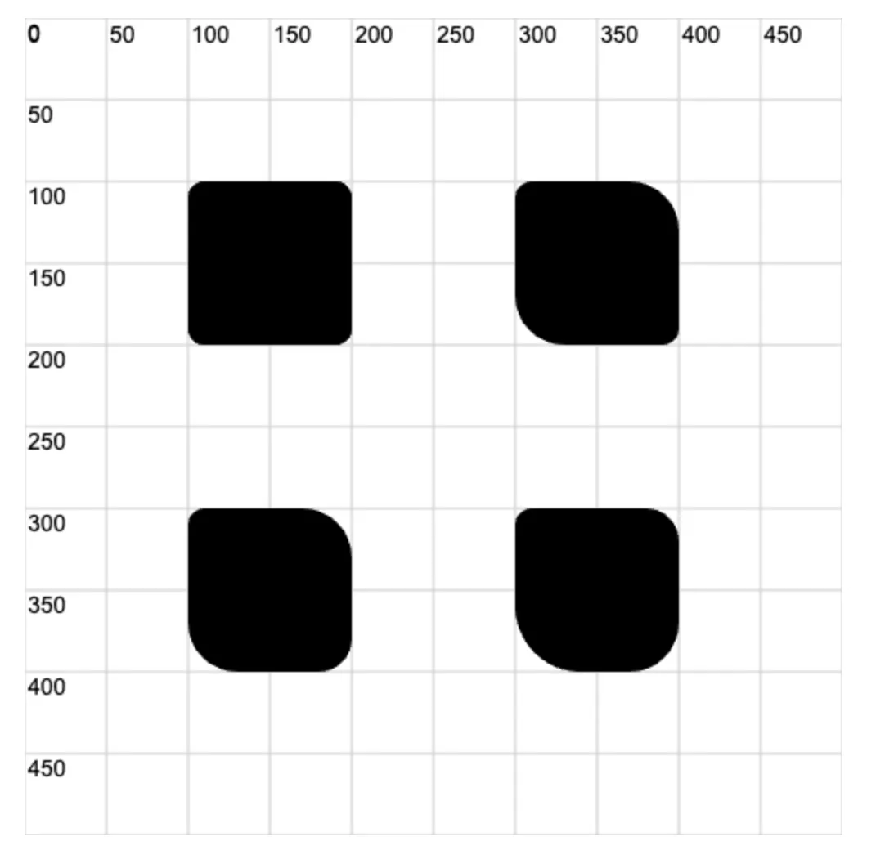

# [0020. 使用 ctx.roundRect 绘制圆角矩形](https://github.com/Tdahuyou/canvas/tree/main/0020.%20%E4%BD%BF%E7%94%A8%20ctx.roundRect%20%E7%BB%98%E5%88%B6%E5%9C%86%E8%A7%92%E7%9F%A9%E5%BD%A2)

- 学会使用 `ctx.roundRect()` 来绘制一个圆角矩形路径。

## 💻 demo1

```html
<!-- 1.html -->
<!DOCTYPE html>
<html lang="en">
  <head>
    <meta charset="UTF-8" />
    <meta name="viewport" content="width=device-width, initial-scale=1.0" />
    <title>Document</title>
  </head>
  <body>
    <script src="./drawGrid.js"></script>
    <script>
      const cavnas = document.createElement('canvas')
      drawGrid(cavnas, 500, 500, 50)
      document.body.appendChild(cavnas)
      const ctx = cavnas.getContext('2d')
      ctx.beginPath()

      ctx.roundRect(100, 100, 200, 200, 50)
      // 100 100 表示矩形左上角的坐标
      // 200 200 表示矩形的宽高
      // 50 表示圆角的大小
      ctx.fill()
    </script>
  </body>
</html>
```



## 💻 demo2

```html
<!-- 2.html -->
<!DOCTYPE html>
<html lang="en">
  <head>
    <meta charset="UTF-8" />
    <meta name="viewport" content="width=device-width, initial-scale=1.0" />
    <title>Document</title>
  </head>
  <body>
    <script src="./drawGrid.js"></script>
    <script>
      const cavnas = document.createElement('canvas')
      drawGrid(cavnas, 500, 500, 50)
      document.body.appendChild(cavnas)
      const ctx = cavnas.getContext('2d')
      ctx.beginPath()

      ctx.roundRect(100, 100, 200, 200, 100)
      // 100 100 表示矩形左上角的坐标
      // 200 200 表示矩形的宽高
      // 100 表示圆角的大小 —— 此时将绘制一个圆形
      ctx.fill()
    </script>
  </body>
</html>
```


## 💻 demo3

```html
<!-- 3.html -->
<!DOCTYPE html>
<html lang="en">
  <head>
    <meta charset="UTF-8" />
    <meta name="viewport" content="width=device-width, initial-scale=1.0" />
    <title>Document</title>
  </head>
  <body>
    <script src="./drawGrid.js"></script>
    <script>
      const cavnas = document.createElement('canvas')
      drawGrid(cavnas, 500, 500, 50)
      document.body.appendChild(cavnas)
      const ctx = cavnas.getContext('2d')
      ctx.beginPath()

      // ctx.roundRect(x, y, width, height, radii)
      // 最后一个参数 radii 可以是一个数值，也可以是一个数组（有多种写法）。

      ctx.roundRect(100, 100, 100, 100, [10])
      // 如果圆角参数是一个单一数值，或者单一数值的数组
      // 那么所有四个角将使用这个相同的半径
      // 四个角的圆角参数都是 10
      ctx.fill()

      ctx.roundRect(300, 100, 100, 100, [10, 30])
      // 如果是一个包含两个值的数组：
      // 第一个值 10 用于左上角和右下角
      // 第二个值 30 用于右上角和左下角
      ctx.fill()

      ctx.roundRect(100, 300, 100, 100, [10, 30, 20])
      // 如果是一个包含三个值的数组：
      // 第一个值 10 用于左上角
      // 第二个值 30 用于右上角和左下角
      // 第三个值 20 用于右下角
      ctx.fill()

      ctx.roundRect(300, 300, 100, 100, [10, 20, 30, 40])
      // 如果是四个值的数组：
      // 第一个值用于左上角
      // 第二个值用于右上角
      // 第三个值用于右下角
      // 第四个值用于左下角
      ctx.fill()
    </script>
  </body>
</html>
```

