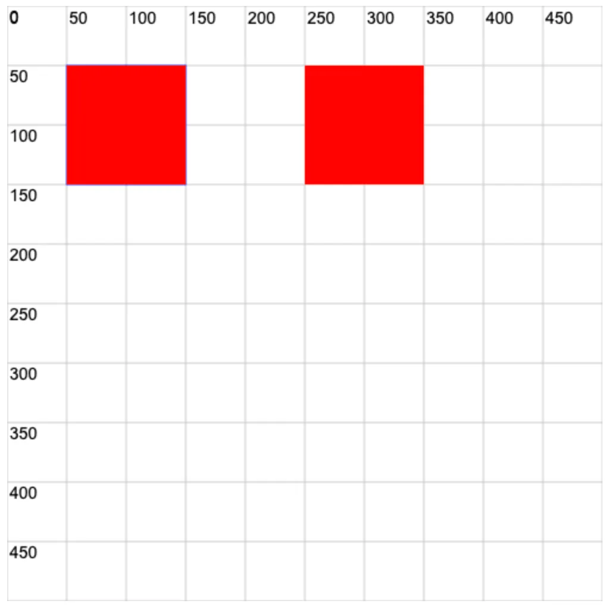
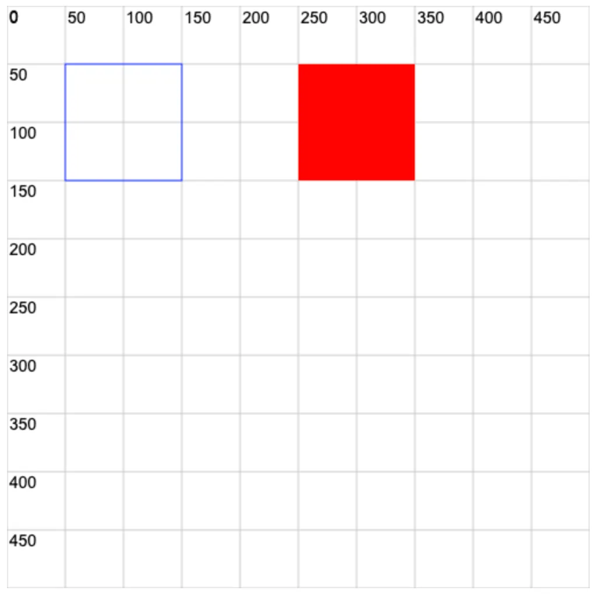

# [0023. 使用 ctx.beginPath 方法对路径进行分组](https://github.com/Tdahuyou/canvas/tree/main/0023.%20%E4%BD%BF%E7%94%A8%20ctx.beginPath%20%E6%96%B9%E6%B3%95%E5%AF%B9%E8%B7%AF%E5%BE%84%E8%BF%9B%E8%A1%8C%E5%88%86%E7%BB%84)

- 学会使用 `ctx.beginPath()` 对路径进行分组，并了解如果不使用分组的话，会存在什么潜在问题。

## 📒 notes

**需求：**
1. 先在 `(50, 50)` 位置绘制一个 `100 x 100` 的矩形轮廓（轮廓颜色为蓝色）
2. 再在 `(250, 50)` 位置绘制一个 `100 x 100` 的红色矩形

下面我们将通过上述这俩简单的小需求，体验一下 `ctx.beginPath()` 的作用。

## 💻 demo1 - 错误写法

```html
<!-- 1.html -->
<!DOCTYPE html>
<html lang="en">
  <head>
    <meta charset="UTF-8" />
    <meta name="viewport" content="width=device-width, initial-scale=1.0" />
    <title>Document</title>
  </head>
  <body>
    <script src="./drawGrid.js"></script>
    <script>
      const cavnas = document.createElement('canvas')
      drawGrid(cavnas, 500, 500, 50)
      document.body.appendChild(cavnas)
      const ctx = cavnas.getContext('2d')
      ctx.beginPath()

      // 错误做法：
      ctx.rect(50, 50, 100, 100)
      ctx.strokeStyle = 'blue'
      ctx.stroke()

      ctx.rect(250, 50, 100, 100)
      ctx.fillStyle = 'red'
      ctx.fill()

      // stroke() 或 fill() 默认会对之前所有绘制的路径进行一个处理。
      // 我们可以用 beginPath() 对路径进行分组处理。
      // 如果不分组的话，那么 fill() 或 stroke() 会对之前所有的路径进行处理。

      // 如果没有调用 beginPath()，那么之前的路径会被保留，新的路径会被添加到之前的路径上。
      // 当执行 stroke() 或 fill() 时，会对所有路径进行处理。

      // 如果调用了 beginPath()，那么之前的路径会被清空，新的路径会被添加到空路径上。
      // 当执行 stroke() 或 fill() 时，只会对新的路径进行处理。
    </script>
  </body>
</html>
```

stroke() 或 fill() 默认会对 **之前所有绘制的路径** 进行一个处理。

这种写法中，在绘制完第一个描边矩形之后，当你绘制第二个填充矩形时，填充将会对之前的路径也起作用。

- 当 `ctx.stroke()` 执行时
  - `(50, 50)` 位置的矩形：加上了蓝色的描边
- 当 `ctx.fill()` 执行时
  - `(50, 50)` 位置的矩形：被填充为了红色
  - `(250, 50)` 位置的矩形：被填充为了红色



## 💻 demo2 - 正确写法 1

```html
<!-- 2.html -->
<!DOCTYPE html>
<html lang="en">
  <head>
    <meta charset="UTF-8" />
    <meta name="viewport" content="width=device-width, initial-scale=1.0" />
    <title>Document</title>
  </head>
  <body>
    <script src="./drawGrid.js"></script>
    <script>
      const cavnas = document.createElement('canvas')
      drawGrid(cavnas, 500, 500, 50)
      document.body.appendChild(cavnas)
      const ctx = cavnas.getContext('2d')
      ctx.beginPath()

      // 正确做法1：
      ctx.rect(50, 50, 100, 100)
      ctx.strokeStyle = 'blue'
      ctx.stroke()

      ctx.beginPath() // 注意，这一行不能少。

      ctx.rect(250, 50, 100, 100)
      ctx.fillStyle = 'red'
      ctx.fill()
    </script>
  </body>
</html>
```

因为在执行 `ctx.fill()` 之前，调用了 `ctx.beginPath()`，相当于对路径做了一个分组，这意味着路径重新开始绘制，别再管之前的路径了。

- 当 `ctx.stroke()` 执行时
  - `(50, 50)` 位置的矩形：加上了蓝色的描边
- 当 `ctx.fill()` 执行时
  - ~~`(50, 50)` 位置的矩形：被填充为了红色~~（这是之前的路径）
  - `(250, 50)` 位置的矩形：被填充为了红色


## 💻 demo3 - 正确写法 2

```html
<!-- 3.html -->
<!DOCTYPE html>
<html lang="en">
  <head>
    <meta charset="UTF-8" />
    <meta name="viewport" content="width=device-width, initial-scale=1.0" />
    <title>Document</title>
  </head>
  <body>
    <script src="./drawGrid.js"></script>
    <script>
      const cavnas = document.createElement('canvas')
      drawGrid(cavnas, 500, 500, 50)
      document.body.appendChild(cavnas)
      const ctx = cavnas.getContext('2d')
      ctx.beginPath()

      // 正确做法2：
      ctx.strokeStyle = 'blue'
      ctx.strokeRect(50, 50, 100, 100)

      // ctx.beginPath()
      // 这里有 or 没有 beginPath() 都可以。

      ctx.fillStyle = 'red'
      ctx.fillRect(250, 50, 100, 100)

      // ctx.fillRect()
      // ctx.strokeRect()
      // 这两个 API 不会受 beginPath 的影响。
      // 因为 strokeRect()、fillRect() 是一个独立的绘制操作，不会受到之前的路径的影响。
    </script>
  </body>
</html>
```


