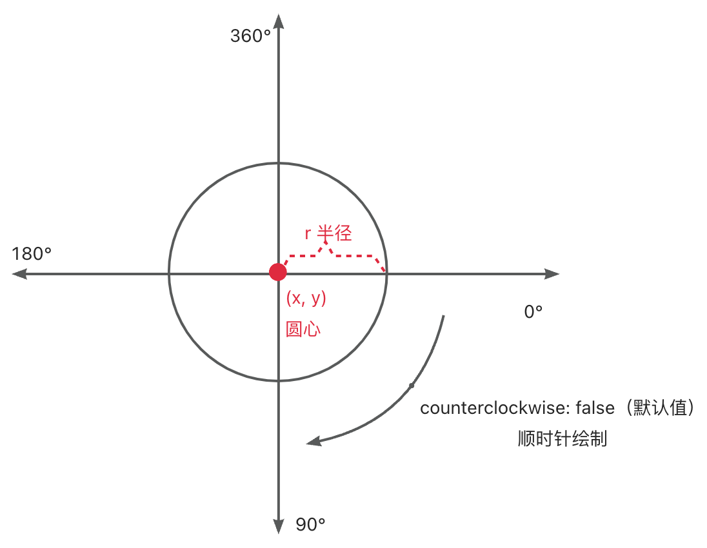
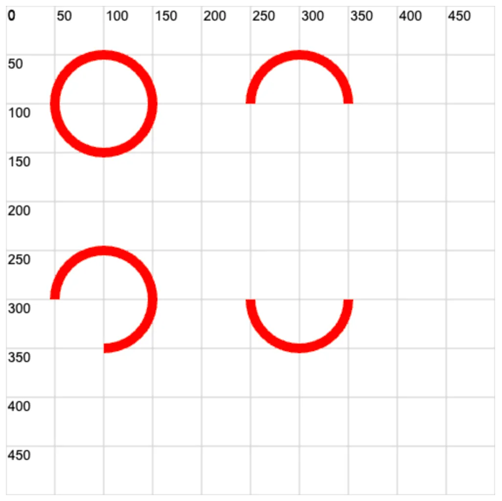

# [0024. 使用 ctx.arc 绘制圆弧](https://github.com/Tdahuyou/canvas/tree/main/0024.%20%E4%BD%BF%E7%94%A8%20ctx.arc%20%E7%BB%98%E5%88%B6%E5%9C%86%E5%BC%A7)


<!-- region:toc -->
- [1. 📝 Summary](#1--summary)
- [2. 📒 notes](#2--notes)
  - [2.1. ctx.arc](#21-ctxarc)
  - [2.2. 角度、弧度的转换](#22-角度弧度的转换)
    - [2.2.1. 1. 角度（Degree）](#221-1-角度degree)
    - [2.2.2. 2. 弧度（Radian）](#222-2-弧度radian)
    - [2.2.3. 3. 转换关系](#223-3-转换关系)
- [3. 💡 圆参考坐标](#3--圆参考坐标)
- [4. 💻 demo1](#4--demo1)
<!-- endregion:toc -->

## 1. 📝 Summary


- 学会使用 `ctx.arc` 绘制圆弧，可以根据文档中提供的图来理解绘制原理。
- 知道角度和弧度之间的区别，清楚它们俩之间的转换关系。

## 2. 📒 notes

### 2.1. ctx.arc

`ctx.arc(x, y, radius, startAngle, endAngle, counterclockwise)`

- `x y radius` 表示圆点坐标、半径。
- `startAngle` 表示从哪个点开始画。单位是弧度。
- `endAngle` 表示画到哪个点结束。单位是弧度。
  - `0` 度点所在位置：`3` 点钟方向。
- `counterclockwise` 表示绘制方向。
  - `false` 顺时针（默认）
  - `true`  逆时针

> **单词**
>
> counterclockwise，表示逆时针方向。

### 2.2. 角度、弧度的转换

角度和弧度都是用来测量平面角的单位，用于描述角的打开程度。

在绘制圆、弧等曲线图形的时候，使用的单位大多都是弧度，而非角度。假如你想要表达 360°，应该传入的参数不是 ~~360~~ 而是 2π 用 JS 来表示就是 `2 * Math.PI`。

以此类推，180° 就是 `Math.PI`，90° 就是 `Math.PI / 2`。

其实，你只需要记住 `1° = Math.PI / 180` 这个等式即可，**如果你想要表达 x°，那么可以写 `x * (Math.PI / 180)`。**

上学那会儿，在数学课上绝对是有介绍过这俩之间的转换的，如果忘记了它们是什么，应该如何转换，可以看看文中提供的相关描述和转换公式。

#### 2.2.1. 1. 角度（Degree）

角度是衡量平面角大小的一种度量单位，符号通常用°表示。一个完整的圆是360°。这种划分方式源于古代天文学家的观察，他们发现每年太阳在黄道上移动的角度大约是360度（实际上接近365天，但360是一个方便的数字，因为它能被多个数字整除）。

- **直角**：一个直角是90°，这意味着一个完整的圆由4个直角组成。
- **平角**：平角是180°，表示两条射线在同一直线上，朝相反方向。
- **周角**：一个完整的圆角是360°。

#### 2.2.2. 2. 弧度（Radian）

弧度是另一种度量角度的方法，它是根据角所截取圆弧的长度与圆的半径的比率来定义的。在数学和工程学中，弧度是更常用的单位，因为它直接与圆的其他性质（如周长和面积）相关联，且在计算中通常更为简便。

- 一个弧度定义为圆上一个与半径长度相等的弧所对应的中心角。
- 一个完整圆的周角为 (2\pi) 弧度，因为一个圆的周长是 (2\pi r)（其中 (r) 是半径），所以当弧长等于半径时，所对应的角就是1弧度。
- 因此，(360^\circ) 相当于 (2\pi) 弧度。

#### 2.2.3. 3. 转换关系

**两种单位之间的转换关系是**：

$$
1\ \text{弧度} = \frac{180^\circ}{\pi} \approx 57.2958^\circ
$$

$$
1^\circ = \frac{\pi}{180} \ \text{弧度}
$$

使用这些关系，你可以在角度和弧度之间进行转换。例如，90°（一个直角）相当于 `π / 2` 弧度。这种转换在解决涉及三角函数和角度测量的数学、物理问题时非常重要。

## 3. 💡 圆参考坐标

可以结合这张图来辅助理解 `ctx.arc` 绘制圆弧的原理。



## 4. 💻 demo1

```html
<!-- 1.html -->
<!DOCTYPE html>
<html lang="en">
  <head>
    <meta charset="UTF-8" />
    <meta name="viewport" content="width=device-width, initial-scale=1.0" />
    <title>📝 使用 ctx.arc 绘制圆弧</title>
  </head>
  <body>
    <script src="./drawGrid.js"></script>
    <script>
      const cavnas = document.createElement('canvas')
      drawGrid(cavnas, 500, 500, 50)
      document.body.appendChild(cavnas)
      const ctx = cavnas.getContext('2d')

      ctx.lineWidth = 10
      ctx.strokeStyle = 'red'

      // ctx.arc(x, y, radius, startAngle, endAngle, counterclockwise)

      // x y radius 表示圆点坐标、半径。

      // startAngle 表示从哪个点开始画。单位是弧度。
      // endAngle   表示画到哪个点结束。单位是弧度。
      // 0 度点所在位置：3 点钟方向。

      // counterclockwise 表示绘制方向。
      // false 顺时针（默认）
      // true  逆时针

      // 圆
      ctx.beginPath()
      ctx.arc(100, 100, 50, 0, Math.PI * 2)
      ctx.stroke()

      // 上半圆
      ctx.beginPath()
      ctx.arc(300, 100, 50, 0, Math.PI, true)
      ctx.stroke()

      // 下半圆
      ctx.beginPath()
      ctx.arc(300, 300, 50, 0, Math.PI, false)
      ctx.stroke()

      // 3/4 圆
      ctx.beginPath()
      ctx.arc(100, 300, 50, Math.PI / 2, Math.PI, true)
      ctx.stroke()
    </script>
  </body>
</html>
```


