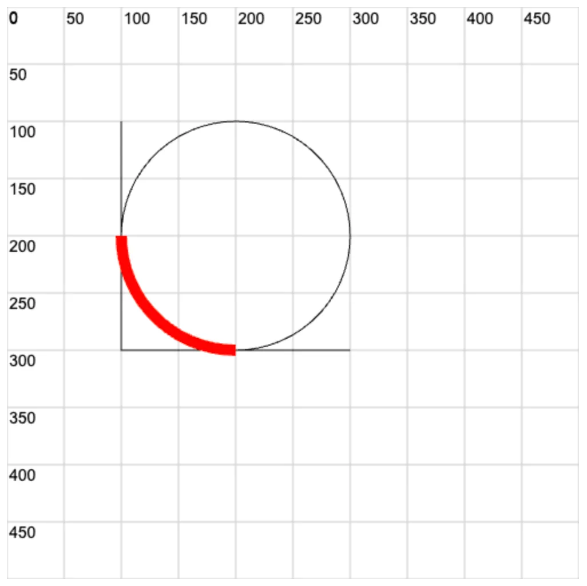
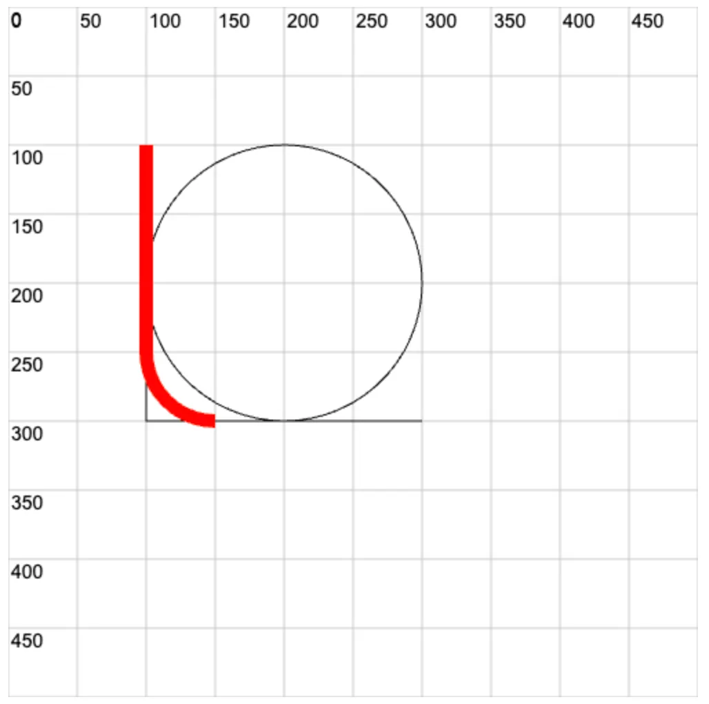

# [0027. 使用 ctx.arcTo 绘制圆弧](https://github.com/Tdahuyou/canvas/tree/main/0027.%20%E4%BD%BF%E7%94%A8%20ctx.arcTo%20%E7%BB%98%E5%88%B6%E5%9C%86%E5%BC%A7)

<!-- region:toc -->
- [1. 📝 Summary](#1--summary)
- [2. 💻 demo1](#2--demo1)
- [3. 💻 demo2](#3--demo2)
<!-- endregion:toc -->

## 1. 📝 Summary

- 学会使用 `ctx.arcTo` 绘制圆弧。
**需要注意：**传入的参数并不决定绘制的线条的起点 or 终点，而仅仅是起到决定圆弧弧度的作用。
`ctx.arcTo` 绘制圆弧比较奇怪，你只需要通过控制点描述出一个角就行，它这玩意儿会根据你给定的角去绘制弧，最终绘制出来的弧的起点和终点，并不一定是从你的控制点开始的。

## 2. 💻 demo1

```html
<!-- 1.html -->
<!DOCTYPE html>
<html lang="en">
  <head>
    <meta charset="UTF-8" />
    <meta name="viewport" content="width=device-width, initial-scale=1.0" />
    <title>📝 arcTo 方法</title>
  </head>
  <body>
    <script src="./drawGrid.js"></script>
    <script>
      const cavnas = document.createElement('canvas')
      drawGrid(cavnas, 500, 500, 50)
      document.body.appendChild(cavnas)
      const ctx = cavnas.getContext('2d')

      // #region 辅助线
      ctx.beginPath()
      ctx.moveTo(100, 100)
      ctx.lineTo(100, 300)
      ctx.lineTo(300, 300)
      ctx.stroke()

      ctx.beginPath()
      ctx.arc(200, 200, 100, 0, Math.PI * 2)
      ctx.stroke()
      // #endregion 辅助线

      // context.arcTo(x1, y1, x2, y2, radius)
      // 用于绘制圆角路径。
      // 常用于绘制具有特定半径的圆角。

      // 第 1 个点：moveTo 指定的点或者上一次图形路径结束的点
      // 第 2 个点：(x1, y1)
      // 第 3 个点：(x2, y2)
      // 由 3 个控制点实现圆弧的绘制。
      // 按照 3 个点的位置，连线，形成一个夹角。
      // 绘制的圆弧，与夹角的两条边相切。
      // 根据指定的半径的不同，绘制出来的圆弧也不同。

      // radius 指定了圆角的大小，即圆弧的半径。
      // 根据 r 绘制圆弧，保证与两个线条相切。
      // 注意：如果 radius 值过大，无法基于提供的点和半径绘制圆角，那么浏览器将不绘制圆弧。

      ctx.beginPath()
      ctx.lineWidth = 10
      ctx.strokeStyle = 'red'
      ctx.moveTo(100, 200) // 起点
      ctx.arcTo(100, 300, 200, 300, 100)
      // 100 300 表示第 1 个控制点
      // 200 300 表示第 2 个控制点
      // 100 表示圆角的半径
      ctx.stroke()
    </script>
  </body>
</html>
```



## 3. 💻 demo2

```html
<!-- 2.html -->
<!DOCTYPE html>
<html lang="en">
  <head>
    <meta charset="UTF-8" />
    <meta name="viewport" content="width=device-width, initial-scale=1.0" />
    <title>📝 arcTo 方法</title>
  </head>
  <body>
    <script src="./drawGrid.js"></script>
    <script>
      const cavnas = document.createElement('canvas')
      drawGrid(cavnas, 500, 500, 50)
      document.body.appendChild(cavnas)
      const ctx = cavnas.getContext('2d')

      // #region 辅助线
      ctx.beginPath()
      ctx.moveTo(100, 100)
      ctx.lineTo(100, 300)
      ctx.lineTo(300, 300)
      ctx.stroke()

      ctx.beginPath()
      ctx.arc(200, 200, 100, 0, Math.PI * 2)
      ctx.stroke()
      // #endregion 辅助线

      ctx.beginPath()
      ctx.lineWidth = 10
      ctx.strokeStyle = 'red'
      ctx.moveTo(100, 100) // 起点坐标
      ctx.arcTo(100, 300, 300, 300, 50)
      // 100 300 表示第 1 个控制点
      // 300 300 表示第 2 个控制点
      // 50 表示圆角的半径
      // 注意：ctx.arcTo 这玩意儿绘制的是圆弧
      // 所以最终结束位置是在圆弧的终点，而非控制点 2 所在的位置。
      // 把控制点 2 的坐标由 300 300 改成 101 300 最终绘制的效果也是一样的。
      // ctx.arcTo(100, 300, 101, 300, 50)
      ctx.stroke()
    </script>
  </body>
</html>
```


