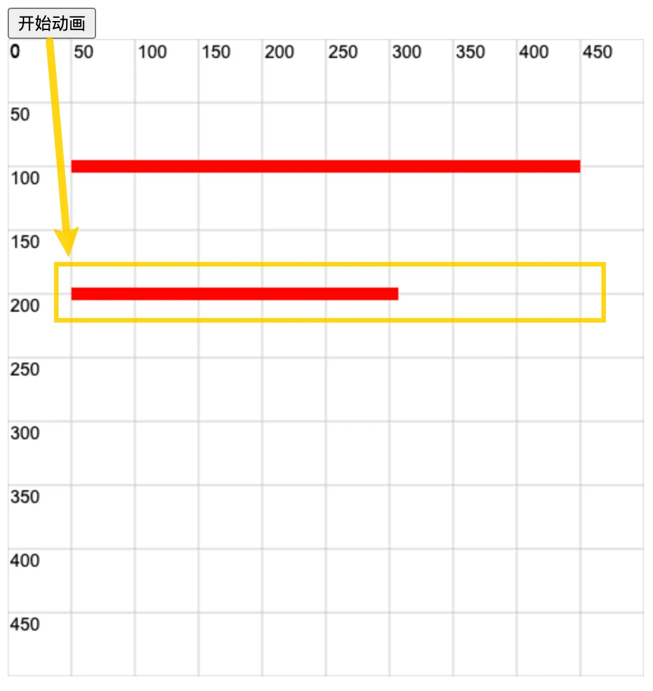
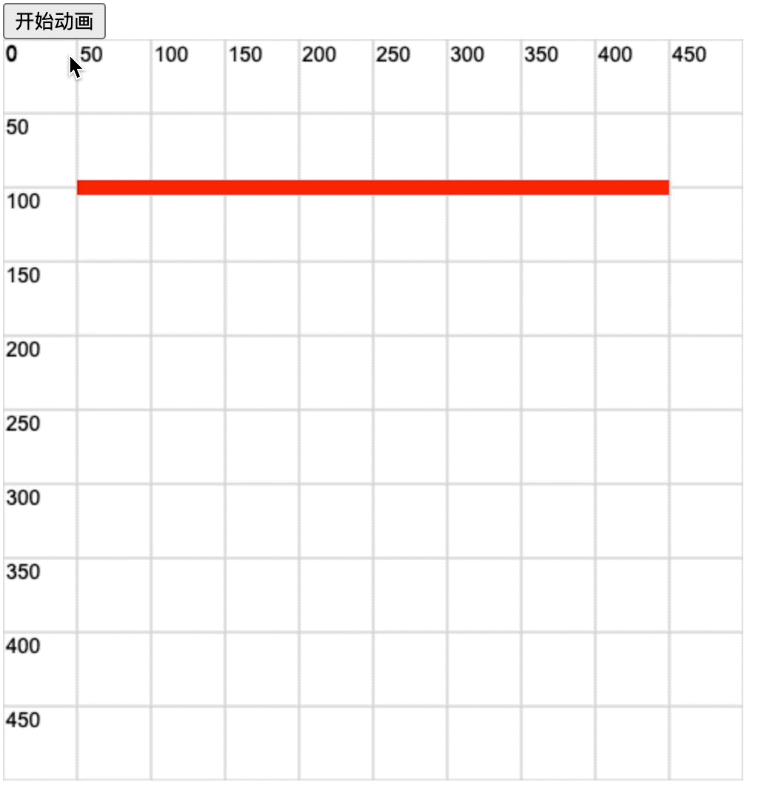

# 0030. 模拟进度条动画效果

- 学会使用 `lineDashOffset` 来设置线条的动画效果。

## 📝 notes

如果线条每次偏移（即，改变 `ctx.lineDashOffset`）的时候，没有清空画布的话，那么线条之前的运动轨迹将保留在界面上。此时看起来就有些类似于进度条加载的效果。

## 💻 demo1

```html
<!-- 1.html -->
 <!DOCTYPE html>
<html lang="en">
  <head>
    <meta charset="UTF-8" />
    <meta name="viewport" content="width=device-width, initial-scale=1.0" />
    <title>Document</title>
  </head>
  <body>
    <div>
      <button id="start-move">开始动画</button>
    </div>

    <script src="./drawGrid.js"></script>
    <script>
      const cavnas = document.createElement('canvas')
      drawGrid(cavnas, 500, 500, 50)
      document.body.appendChild(cavnas)
      const ctx = cavnas.getContext('2d')

      ctx.lineWidth = 10
      ctx.strokeStyle = 'red'

      ctx.beginPath()
      ctx.moveTo(50, 100)
      ctx.lineTo(450, 100)
      ctx.stroke()

      ctx.beginPath()
      ctx.setLineDash([400])
      ctx.lineDashOffset = 400
      ctx.moveTo(50, 200)
      ctx.lineTo(450, 200)
      ctx.stroke()

      function move() {
        ctx.lineDashOffset--
        console.log(ctx.lineDashOffset)
        // 通过不断改变 lineDashOffset 的值，实现动画效果。
        ctx.stroke()

        if (ctx.lineDashOffset > 0) {
          requestAnimationFrame(move)
        }
      }
      const startMoveBtn = document.getElementById('start-move')
      startMoveBtn.addEventListener('click', move)
    </script>
  </body>
</html>
```

点击【开始运动】按钮后，进度条会从起点加载到终点。



最终效果如下图所示。


