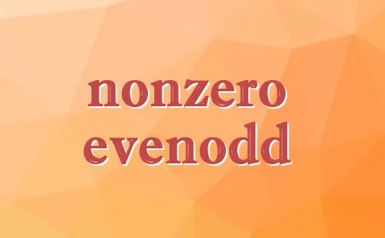
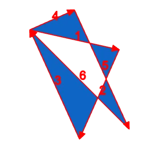
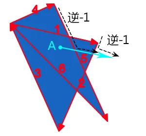
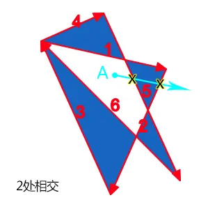
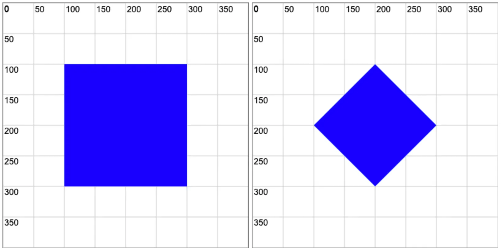
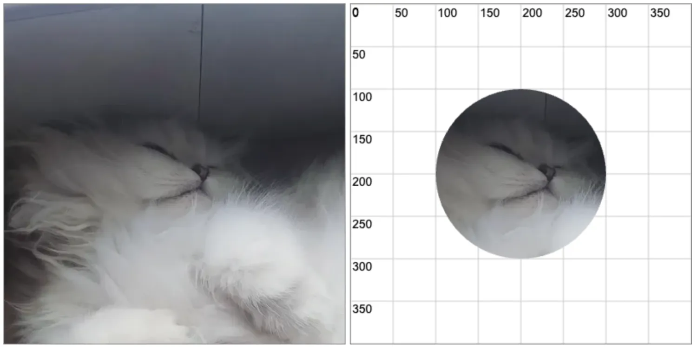
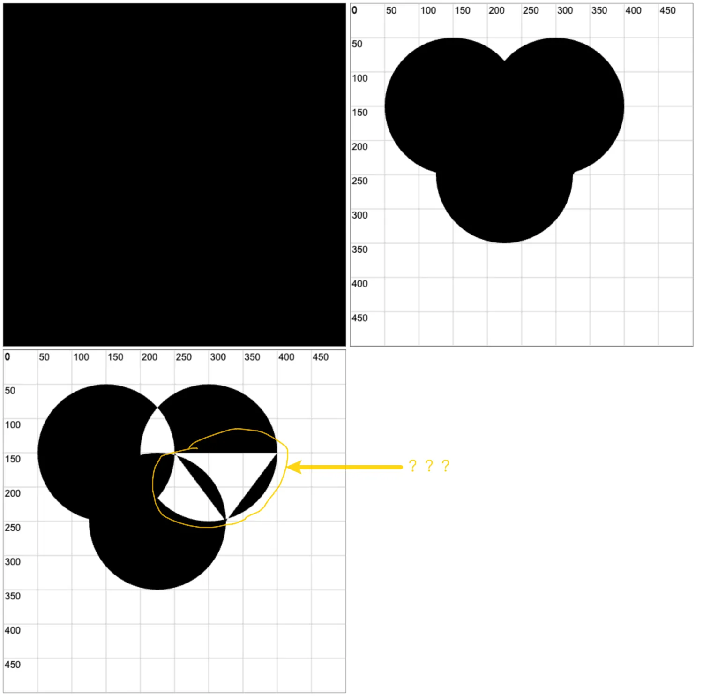

# [0031. 使用 ctx.clip 实现图像裁剪](https://github.com/Tdahuyou/canvas/tree/main/0031.%20%E4%BD%BF%E7%94%A8%20ctx.clip%20%E5%AE%9E%E7%8E%B0%E5%9B%BE%E5%83%8F%E8%A3%81%E5%89%AA)

<!-- region:toc -->
- [1. 🔗 links](#1--links)
- [2. 📒 `ctx.clip` 简介](#2--ctxclip-简介)
- [3. 👨‍🏫 搞懂 SVG/Canvas 中 nonzero 和 evenodd 填充规则](#3--搞懂-svgcanvas-中-nonzero-和-evenodd-填充规则)
  - [3.1. 填充有两种规则](#31-填充有两种规则)
  - [3.2. 一切都是交叉点们的选择](#32-一切都是交叉点们的选择)
  - [3.3. 啦啦啦，结束语](#33-啦啦啦结束语)
- [4. 💻 demos.1 - 裁剪菱形](#4--demos1---裁剪菱形)
- [5. 💻 demos.2 - 裁剪圆形](#5--demos2---裁剪圆形)
- [6. 💻 demos.3 - 理解 fillRule](#6--demos3---理解-fillrule)
- [7. 💻 demos.4 - 问题记录](#7--demos4---问题记录)
<!-- endregion:toc -->
- ctx.clip 的基本使用是比较简单的，但是填充规则不太好理解，并且暂时也还不清楚填充规则有何实际的应用场景……
- 对于填充规则的介绍，文中引用了“张鑫旭”老师的博客文章 —— 搞懂 SVG/Canvas 中 nonzero 和 evenodd 填充规则。
- ⏰ 在这篇文章的最后一个示例中，存在个问题还没理解。
- nonzero 和 evenodd 填充规则在笔记 svg.0024 中也有提及。

## 1. 🔗 links

- https://www.zhangxinxu.com/wordpress/2018/10/nonzero-evenodd-fill-mode-rule/ - 搞懂SVG/Canvas中nonzero和evenodd填充规则 « 张鑫旭-鑫空间-鑫生活。
- https://developer.mozilla.org/zh-CN/docs/Web/API/CanvasRenderingContext2D/clip - MDN - CanvasRenderingContext2D：clip() 方法
- https://en.wikipedia.org/wiki/Even%E2%80%93odd_rule - Wiki - Even–odd rule
- https://en.wikipedia.org/wiki/Nonzero-rule - Wiki - Nonzero-rule

## 2. 📒 `ctx.clip` 简介

`ctx.clip` 用来裁剪图像，难点在于理解填充规则。

下面截图是来自 wiki 中对于 Even–odd rule 的解释。


当画布上出现多个闭合路径的时候，区分哪些区域是有效区域。

## 3. 👨‍🏫 搞懂 SVG/Canvas 中 nonzero 和 evenodd 填充规则

> 注：以下为搬运内容！

### 3.1. 填充有两种规则



只要是路径填充，都有两种规则，nonzero和evenodd，无论是SVG中的路径填充，还是Canvas中的路径填充，如果还有其他和路径相关的技术（甚至设计软件），也离不开这两种填充规则。

换句话说，这是超越各种语言，普世通用的技能点。

下面，看看我能不能用足够精简的语言，尽可能让大家都搞懂这两种路径填充规则。

如果我们用3个点，连成一个三角形，则这两种填充规则没什么区别，如下对比（Canvas语法举例，JS实时渲染，如果无效果，请[访问原文](https://www.zhangxinxu.com/wordpress/?p=8043)）。

| nonzero（默认）                      | evenodd                              |
| ------------------------------------ | ------------------------------------ |
|  |  |


如果是两个三角形，并且发生重叠，差异就出现了，如下：

| nonzero（默认）                      | evenodd                              |
| ------------------------------------ | ------------------------------------ |
|  |  |


究竟是如何作用的呢？且看~

### 3.2. 一切都是交叉点们的选择

填充规则的关键，就是确定复杂路径构成的图形，哪些是内部，哪些是外部。内部则填充，外部则透明。

“nonzero规则”顾名思意就是“非零规则”，用通俗的话讲，就算计算某些东西是不是`0`，如果不是`0`则内部，填充；如果是`0`则外部，不填充。

“evenodd规则”顾名思意就是“奇偶规则”，用通俗的话讲，就算计算某些东西是不是奇数，如果是是奇数则内部，填充；如果是偶数则外部，不填充。

下面关键来了，这里的“计算某些东西”究竟计算的是什么东西呢？

nonzero规则和evenodd规则计算的东西还不一样，nonzero是计算顺时针逆时针数量，evenodd是交叉路径数量。

---

为了示意更加直观，我们可以把本文示意的三角路径方向和序号标记下，如下表：

| nonzero（默认）                      | evenodd                              |
| ------------------------------------ | ------------------------------------ |
|  |  |


接下来，高能来了……

---

我们要判断某一个区域是路径内还是路径外，很简单，在这个区域内任意找一个点，然后以这个点为起点，发射一条无限长的射线，然后——

- 对于nonzero规则：起始值为0，射线会和路径相交，如果路径方向和射线方向形成的是顺时针方向则+1，如果是逆时针方向则-1，最后如果数值为0，则是路径的外部；如果不是0，则是路径的内部，因此被称为“非0规则”。

一图胜千言：



例如上图点A，我们随便发出一条射线，结果经过了路径5和路径2，我们顺着路径前进方向和射线前进方向，可以看到，合并后的运动方向都是逆时针，逆时针方向-1，因此，最后计算值是-2，不是0，因此，是内部，fill时候可以被填充。

再看外部的例子，一图胜千言+1：


点B再发出一条射线，经过两条路径片段，为路径2和路径3，我们顺着路径前进方向和射线前进方向，可以看到，合并后的运动方向一个是逆时针，-1，一个是顺时针，+1，因此，最后的计算值是0，是外部，因此，不被填充。

+ 对于evenodd规则：起始值为0，射线会和路径相交，每交叉一条路径，我们计数就+1，最后看我们的总计算数值，如果是奇数，则认为是路径内部，如果是偶数，则认为是路径外部。

一图胜千言+2：



例如上图点A，我们随便发出一条射线，结果经过了路径5和路径2，交叉的路径个数为2，是偶数，因此，属于路径外，不填充。

一图胜千言+3：


点B再发出一条射线，经过路径片段路径2和路径3，交叉的路径个数为2，是偶数，因此，也属于路径外，不填充。

一图胜千言+4：


最后这个点C，发出的射线总共和3个路径交叉，是奇数。因此，属于路径内，填充。

### 3.3. 啦啦啦，结束语

不知大家搞懂没？


## 4. 💻 demos.1 - 裁剪菱形

```html
<!DOCTYPE html>
<html lang="en">
  <head>
    <meta charset="UTF-8" />
    <meta http-equiv="X-UA-Compatible" content="IE=edge" />
    <meta name="viewport" content="width=device-width, initial-scale=1.0" />
    <title>Document</title>
    <style>
      canvas {
        border: 1px solid #888;
        margin-right: 5px;
      }
    </style>
  </head>
  <body>
    <script src="../drawGrid.js"></script>
    <script>
      // 使用 ctx.clip() 方法设置裁剪区域。
      // 接下来绘制的图形只会在裁剪路径中展示。
      // 在指定裁剪区域之前绘制的图形不会受到影响。

      // 注意：裁剪的时候是先指定裁剪区域再绘制图形。

      // 绘制一个蓝色矩形。
      {
        const canvas = document.createElement('canvas')
        drawGrid(canvas, 400, 400, 50)
        document.body.append(canvas)
        const ctx = canvas.getContext('2d')

        ctx.beginPath()
        ctx.fillStyle = 'blue'
        ctx.fillRect(100, 100, 200, 200)
      }

      // 从一个蓝色的矩形中裁剪出一个菱形。
      {
        const canvas = document.createElement('canvas')
        drawGrid(canvas, 400, 400, 50)
        document.body.append(canvas)
        const ctx = canvas.getContext('2d')

        // 菱形裁剪区域
        ctx.beginPath()
        ctx.moveTo(100, 200)
        ctx.lineTo(200, 100)
        ctx.lineTo(300, 200)
        ctx.lineTo(200, 300)
        ctx.closePath()
        ctx.clip()

        // 下面绘制的矩形，只有在上述菱形中的那一部分区域会正常展示。
        ctx.beginPath()
        ctx.fillStyle = 'blue'
        ctx.fillRect(100, 100, 200, 200)
      }

    </script>
  </body>
</html>
```



## 5. 💻 demos.2 - 裁剪圆形

```html
<!DOCTYPE html>
<html lang="en">
  <head>
    <meta charset="UTF-8" />
    <meta http-equiv="X-UA-Compatible" content="IE=edge" />
    <meta name="viewport" content="width=device-width, initial-scale=1.0" />
    <title>Document</title>
    <style>
      canvas {
        border: 1px solid #888;
        margin-right: 5px;
      }
    </style>
  </head>
  <body>
    <script src="../drawGrid.js"></script>
    <script>
      {
        const canvas = document.createElement('canvas')
        drawGrid(canvas, 400, 400, 50)
        document.body.append(canvas)
        const ctx = canvas.getContext('2d')
        const img = new Image()
        img.src = './we.png'
        img.onload = function () {
          ctx.drawImage(img, -200, -10)
        }
      }

      // 裁剪出 we 的头像
      {
        const canvas = document.createElement('canvas')
        drawGrid(canvas, 400, 400, 50)
        document.body.append(canvas)
        const ctx = canvas.getContext('2d')

        const img = new Image()
        img.src = '../we.png'
        img.onload = function () {
          ctx.beginPath()
          ctx.arc(200, 200, 100, 0, Math.PI * 2)
          ctx.clip()

          ctx.drawImage(img, -200, -10)
        }
      }
    </script>
  </body>
</html>
```



## 6. 💻 demos.3 - 理解 fillRule

```html
<!DOCTYPE html>
<html lang="en">
  <head>
    <meta charset="UTF-8" />
    <meta http-equiv="X-UA-Compatible" content="IE=edge" />
    <meta name="viewport" content="width=device-width, initial-scale=1.0" />
    <title>Document</title>
    <style>
      canvas {
        border: 1px solid #888;
        margin-right: 5px;
      }
    </style>
  </head>
  <body>
    <script src="../drawGrid.js"></script>
    <script>
      // ctx.clip 方法还可以传递一个参数，表示裁剪路径的填充规则（fillRule）。

      // 🤔 为什么需要填充规则（fillRule）？
      // 因为在绘制裁剪路径的时候，有些路径区域可能会被重复包含。

      // 填充规则（fillRule）：
      // nonzero  非零环绕路径（默认值）
      // evenodd  奇偶环绕路径

      // 本文的两个示例，如果不理解的话，可以看看下面 👇 的推荐文章。

      // 推荐文章：
      // https://www.zhangxinxu.com/wordpress/2018/10/nonzero-evenodd-fill-mode-rule/
      // 搞懂SVG/Canvas中nonzero和evenodd填充规则
      // —— 张鑫旭

      // nonzero 示例
      {
        const canvas = document.createElement('canvas')
        drawGrid(canvas, 400, 400, 50)
        document.body.append(canvas)
        const ctx = canvas.getContext('2d')

        ctx.lineWidth = 5
        ctx.fillStyle = '#2d66bd'
        ctx.strokeStyle = '#e83727'

        ctx.beginPath()
        ctx.moveTo(100, 100)
        ctx.lineTo(350, 150)
        ctx.lineTo(225, 400)
        ctx.lineTo(100, 100)
        ctx.lineTo(220, 50)
        ctx.lineTo(360, 360)
        ctx.lineTo(100, 100)
        ctx.clip('nonzero')
        // nonzero 是默认值，因此 ctx.clip() 不传递参数效果也是一样的效果。

        ctx.fillRect(0, 0, canvas.width, canvas.height)
        ctx.stroke()
      }

      // evenodd 示例
      {
        const canvas = document.createElement('canvas')
        drawGrid(canvas, 400, 400, 50)
        document.body.append(canvas)
        const ctx = canvas.getContext('2d')

        ctx.lineWidth = 5
        ctx.fillStyle = '#2d66bd'
        ctx.strokeStyle = '#e83727'

        ctx.beginPath()
        ctx.moveTo(100, 100)
        ctx.lineTo(350, 150)
        ctx.lineTo(225, 400)
        ctx.lineTo(100, 100)
        ctx.lineTo(220, 50)
        ctx.lineTo(360, 360)
        ctx.lineTo(100, 100)
        ctx.clip('evenodd')

        ctx.fillRect(0, 0, canvas.width, canvas.height)
        ctx.stroke()
      }

    </script>
  </body>
</html>
```


## 7. 💻 demos.4 - 问题记录

```html
<!DOCTYPE html>
<html lang="en">
  <head>
    <meta charset="UTF-8" />
    <meta http-equiv="X-UA-Compatible" content="IE=edge" />
    <meta name="viewport" content="width=device-width, initial-scale=1.0" />
    <title>Document</title>
    <style>
      canvas {
        border: 1px solid #888;
        margin-right: 5px;
      }
    </style>
  </head>
  <body>
    <script src="../drawGrid.js"></script>
    <script>
      // 被裁剪的参考图像。
      {
        const canvas = document.createElement('canvas')
        drawGrid(canvas, 500, 500, 50)
        document.body.append(canvas)
        const ctx = canvas.getContext('2d')

        ctx.beginPath()
        ctx.fillRect(0, 0, canvas.width, canvas.height)
      }

      {
        const canvas = document.createElement('canvas')
        drawGrid(canvas, 500, 500, 50)
        document.body.append(canvas)
        const ctx = canvas.getContext('2d')

        ctx.beginPath()
        ctx.arc(150, 150, 100, 0, Math.PI * 2, false) // 顺时针
        ctx.arc(300, 150, 100, 0, Math.PI * 2, false) // 顺时针
        ctx.arc(225, 250, 100, 0, Math.PI * 2, false) // 顺时针
        ctx.clip('nonzero')

        ctx.fillRect(0, 0, canvas.width, canvas.height)
      }

      /*
      问题：
      暂时还不理解为什么最终渲染出来的图像。
      */
      {
        const canvas = document.createElement('canvas')
        drawGrid(canvas, 500, 500, 50)
        document.body.append(canvas)
        const ctx = canvas.getContext('2d')

        ctx.beginPath()
        ctx.arc(150, 150, 100, 0, Math.PI * 2, false) // 顺时针
        ctx.arc(300, 150, 100, 0, Math.PI * 2, true) //  逆时针
        ctx.arc(225, 250, 100, 0, Math.PI * 2, false) // 顺时针
        ctx.clip('nonzero')

        ctx.fillRect(0, 0, canvas.width, canvas.height)
      }
    </script>
  </body>
</html>
```

