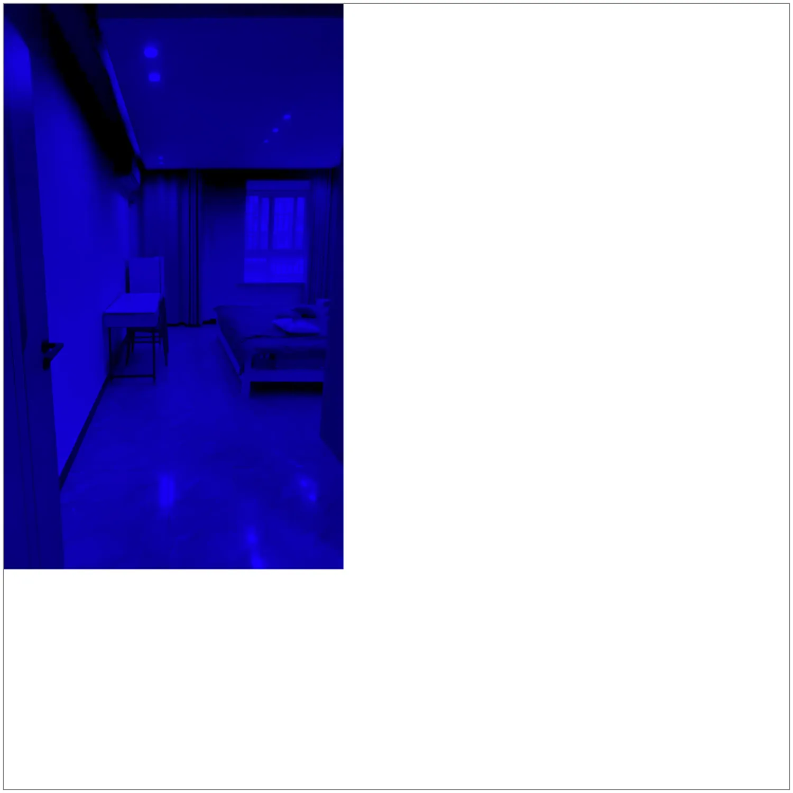

# 0036. 使用 ctx.getImageData、ctx.putImageData 实现图像的像素处理

先对 `ctx.getImageData`、`ctx.putImageData` 的使用有个基本的了解即可。想要玩 6️⃣ 它们，还需要去学习图像颜色处理的更多知识。
文档中提到的示例，处理逻辑都是：
1. 先读图片数据 `ctx.getImageData`
2. 再对图片数据进行修改
3. 最后将修改后的数据写入图片 `ctx.putImageData`

## 🔗 links

- https://developer.mozilla.org/en-US/docs/Web/API/CanvasRenderingContext2D/getImageData - MDN - CanvasRenderingContext2D: getImageData() method，读图片数据。
- https://developer.mozilla.org/en-US/docs/Web/API/CanvasRenderingContext2D/putImageData - MDN - CanvasRenderingContext2D: putImageData() method，写图片数据。

## 📝 notes

ctx.getImageData、ctx.putImageData 这俩 API 的功能很强大，能玩出很多效果 —— 因为拿到了整个图像的所有像素点数据。

素材原图像：


## 💻 demo1 - 置灰

```html
<!-- 1.html -->
<!DOCTYPE html>
<html lang="en">
  <head>
    <meta charset="UTF-8" />
    <meta http-equiv="X-UA-Compatible" content="IE=edge" />
    <meta name="viewport" content="width=device-width, initial-scale=1.0" />
    <title>Document</title>
    <style>
      canvas {
        border: 1px solid #888;
        margin-right: 5px;
      }
    </style>
  </head>
  <body>
    <script>
      // 【读】读取图片像素点的 rgba 值
      // imageData = ctx.getImageData(x, y, width, height)
      // imageData.data 是一个一维数组
      // 每 4 位表示一个像素点的 rgba 值

      // 【写】设置图片像素点的 rgba 值
      // ctx.putImageData(imageData, x, y)
      // 在读取到 imageData 数据之后，可以对每个像素点的 rgba 值进行处理，然后再将处理后的数据放回到 canvas 中。
      // 比如可以对原图进行置灰、反色等处理。

      // 注意：要使用 open with Live Server 打开，否则会报跨域错误。

      const canvas = document.createElement('canvas')
      canvas.width = 800
      canvas.height = 800
      document.body.append(canvas)

      const ctx = canvas.getContext('2d')

      // console.log(
      //   '(0, 0) 点到 (10, 10) 点围成的区域 像素点数量：',
      //   ctx.getImageData(0, 0, 10, 10).data.length / 4
      // )

      const img = new Image()
      img.src = './home.png'
      img.onload = function () {
        ctx.drawImage(img, 0, 0)

        const imageData = ctx.getImageData(0, 0, img.width, img.height)
        for (let i = 0; i < imageData.data.length; i += 4) {
          const r = imageData.data[i]
          const g = imageData.data[i + 1]
          const b = imageData.data[i + 2]
          // const a = imageData.data[i + 3]

          // 图像置灰处理
          const avg = (r + g + b) / 3
          imageData.data[i] = avg
          imageData.data[i + 1] = avg
          imageData.data[i + 2] = avg
        }
        ctx.putImageData(imageData, 0, 0)
        // ctx.putImageData(imageData, img.width, 0) // 将置灰的图像放在原图像右侧
      }
    </script>
  </body>
</html>
```


## 💻 demo2 - 图像反色处理

```html
<!-- 2.html -->
<!DOCTYPE html>
<html lang="en">
  <head>
    <meta charset="UTF-8" />
    <meta http-equiv="X-UA-Compatible" content="IE=edge" />
    <meta name="viewport" content="width=device-width, initial-scale=1.0" />
    <title>Document</title>
    <style>
      canvas {
        border: 1px solid #888;
        margin-right: 5px;
      }
    </style>
  </head>
  <body>
    <script>
      const canvas = document.createElement('canvas')
      canvas.width = 800
      canvas.height = 800
      document.body.append(canvas)

      const ctx = canvas.getContext('2d')

      const img = new Image()
      img.src = './home.png'
      img.onload = function () {
        ctx.drawImage(img, 0, 0)

        const imageData = ctx.getImageData(0, 0, img.width, img.height)
        for (let i = 0; i < imageData.data.length; i += 4) {
          const r = imageData.data[i]
          const g = imageData.data[i + 1]
          const b = imageData.data[i + 2]

          // 图像反色处理
          imageData.data[i] = 255 - r
          imageData.data[i + 1] = 255 - g
          imageData.data[i + 2] = 255 - b
        }
        ctx.putImageData(imageData, 0, 0)
      }
    </script>
  </body>
</html>
```


## 💻 demo3 - 置蓝

```html
<!-- 3.html -->
<!DOCTYPE html>
<html lang="en">
  <head>
    <meta charset="UTF-8" />
    <meta http-equiv="X-UA-Compatible" content="IE=edge" />
    <meta name="viewport" content="width=device-width, initial-scale=1.0" />
    <title>Document</title>
    <style>
      canvas {
        border: 1px solid #888;
        margin-right: 5px;
      }
    </style>
  </head>
  <body>
    <script>
      // 置蓝：将红色绿色通道设置为 0，蓝色通道的值保留不变。
      // 置红：将绿色蓝色通道设置为 0，红色通道的值保留不变。
      // 置绿：将红色蓝色通道设置为 0，绿色通道的值保留不变。

      // 通过对像素的处理，还能实现很多效果。
      // 毕竟都拿到了一张图片的所有像素点数据了，想怎么处理都行。
      //   颜色变换
      //   滤镜效果
      //   马赛克
      //   图像合成
      //   动画效果
      //   图形填充
      //   ……
      const canvas = document.createElement('canvas')
      canvas.width = 800
      canvas.height = 800
      document.body.append(canvas)

      const ctx = canvas.getContext('2d')

      const img = new Image()
      img.src = './home.png'
      img.onload = function () {
        ctx.drawImage(img, 0, 0)

        const imageData = ctx.getImageData(0, 0, img.width, img.height)
        for (let i = 0; i < imageData.data.length; i += 4) {
          // 置蓝
          imageData.data[i] = 0 // 红色通道设置为 0
          imageData.data[i + 1] = 0 // 绿色通道设置为 0
        }
        ctx.putImageData(imageData, 0, 0)
      }
    </script>
  </body>
</html>
```


