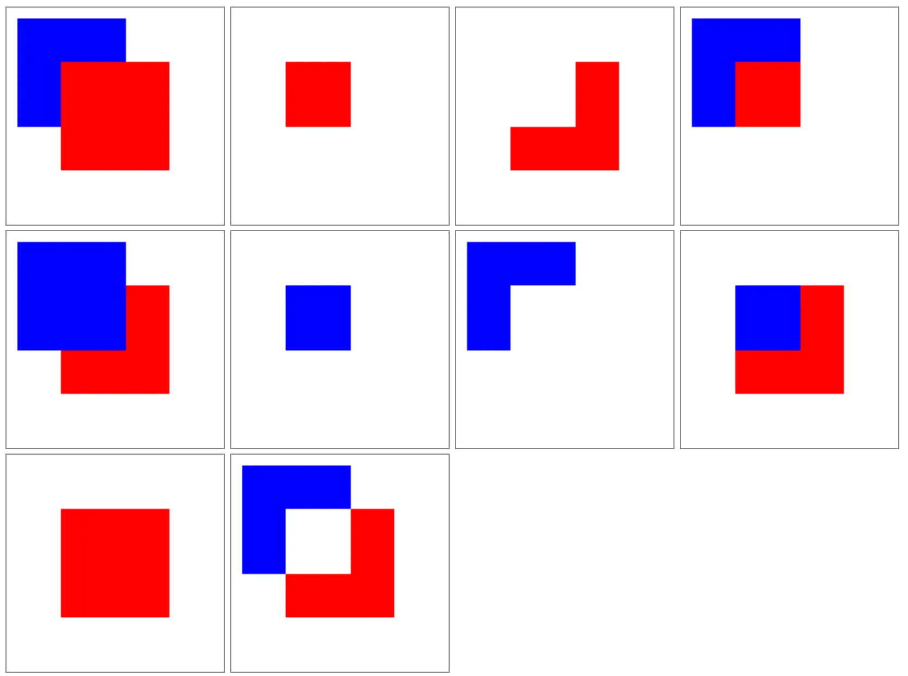

# 0037. 使用 ctx.globalCompositeOperation 处理图像合成

理解单词 source（源）和目标 destination（目标）的含义，有助于对 `ctx.globalCompositeOperation` 的相关属性值（`source-over`、`destination-in`……）的理解。

至于合成颜色，比如更亮 lighter、更暗 darken、颜色盘 hue 等等和颜色相关的，可以先跳过，因为还看不懂它的颜色具体是如何计算出来的，只要对最终呈现的效果有个大致的概念即可（比如你想要让合成区域亮一些，知道用 `lighter` 这个值来尝试下就行，至于如何微调就先不用去想了）。

## 🔗 links

- https://developer.mozilla.org/en-US/docs/Web/API/CanvasRenderingContext2D/globalCompositeOperation - MDN - ctx.globalCompositeOperation

## 📝 notes

`ctx.globalCompositeOperation` 用于设置如何将新绘制的图像与已存在的画布内容合成，决定新图像如何与底层内容相结合。

从代码书写层面，需要掌握 `ctx.globalCompositeOperation` 的写法。至于最终渲染效果的一些细节先不管，这部分的内容涉及到图像合成技术相关的专业知识。

**比较典型的应用场景：**
- “橡皮擦”效果
  - destination-out
  - 在原图上面绘制新的图形，把原图形中的图案给擦掉。
- “图层”效果

> **单词**
> destination 目标
> composite 合成
> operation 操作

## 💻 demo1

```html
<!-- 1.html -->
<!DOCTYPE html>
<html lang="en">
  <head>
    <meta charset="UTF-8" />
    <meta http-equiv="X-UA-Compatible" content="IE=edge" />
    <meta name="viewport" content="width=device-width, initial-scale=1.0" />
    <title>Document</title>
    <style>
      canvas {
        border: 1px solid #888;
        margin-right: 5px;
      }
    </style>
  </head>
  <body>
    <script>
      // ctx.globalCompositeOperation
      // 用于设置在已有的画布内容上绘制新图形时，如何控制这些图形之间的合成或混合模式。
      // 通过改变这个属性的值，你可以定义新图形应该如何与背景的已有图形相结合。

      // Source（源）
      // 指的是你正尝试在画布上绘制的新图形或图像。

      // Destination（目标）
      // 指的是画布上已经存在的图形或图像。

      // source-over（默认值） 新的图形会绘制在旧图形上方。
      {
        const canvas = document.createElement('canvas')
        canvas.width = 200
        canvas.height = 200
        document.body.append(canvas)
        const ctx = canvas.getContext('2d')

        ctx.fillStyle = 'blue'
        ctx.fillRect(10, 10, 100, 100)

        // ctx.globalCompositeOperation = 'source-over'
        // 这条语句写或者不写都一样，因为默认值就是 source-over。

        ctx.fillStyle = 'red'
        ctx.fillRect(50, 50, 100, 100)
      }

      // source-in 新图形只在旧图形和新图形重叠的部分显示。
      {
        const canvas = document.createElement('canvas')
        canvas.width = 200
        canvas.height = 200
        document.body.append(canvas)
        const ctx = canvas.getContext('2d')

        ctx.fillStyle = 'blue'
        ctx.fillRect(10, 10, 100, 100)

        ctx.globalCompositeOperation = 'source-in'

        ctx.fillStyle = 'red'
        ctx.fillRect(50, 50, 100, 100)
      }

      // source-out 新图形只在与旧图形不重叠的部分显示。
      {
        const canvas = document.createElement('canvas')
        canvas.width = 200
        canvas.height = 200
        document.body.append(canvas)
        const ctx = canvas.getContext('2d')

        ctx.fillStyle = 'blue'
        ctx.fillRect(10, 10, 100, 100)

        ctx.globalCompositeOperation = 'source-out'

        ctx.fillStyle = 'red'
        ctx.fillRect(50, 50, 100, 100)
      }

      // source-atop 新图形只在与旧图形重叠的部分显示，且这部分会显示在旧图形之上。
      {
        const canvas = document.createElement('canvas')
        canvas.width = 200
        canvas.height = 200
        document.body.append(canvas)
        const ctx = canvas.getContext('2d')

        ctx.fillStyle = 'blue'
        ctx.fillRect(10, 10, 100, 100)

        ctx.globalCompositeOperation = 'source-atop'

        ctx.fillStyle = 'red'
        ctx.fillRect(50, 50, 100, 100)
      }

      // destination-over 新图形会绘制在旧图形的下方。
      {
        const canvas = document.createElement('canvas')
        canvas.width = 200
        canvas.height = 200
        document.body.append(canvas)
        const ctx = canvas.getContext('2d')

        ctx.fillStyle = 'blue'
        ctx.fillRect(10, 10, 100, 100)

        ctx.globalCompositeOperation = 'destination-over'

        ctx.fillStyle = 'red'
        ctx.fillRect(50, 50, 100, 100)
      }

      // destination-in 旧图形只在与新图形重叠的部分显示。
      {
        const canvas = document.createElement('canvas')
        canvas.width = 200
        canvas.height = 200
        document.body.append(canvas)
        const ctx = canvas.getContext('2d')

        ctx.fillStyle = 'blue'
        ctx.fillRect(10, 10, 100, 100)

        ctx.globalCompositeOperation = 'destination-in'

        ctx.fillStyle = 'red'
        ctx.fillRect(50, 50, 100, 100)
      }

      // destination-out 旧图形只在与新图形不重叠的部分显示。
      {
        const canvas = document.createElement('canvas')
        canvas.width = 200
        canvas.height = 200
        document.body.append(canvas)
        const ctx = canvas.getContext('2d')

        ctx.fillStyle = 'blue'
        ctx.fillRect(10, 10, 100, 100)

        ctx.globalCompositeOperation = 'destination-out'

        ctx.fillStyle = 'red'
        ctx.fillRect(50, 50, 100, 100)
      }

      // destination-atop 旧图形只在与新图形重叠的部分显示，且这部分会显示在新图形之上。
      {
        const canvas = document.createElement('canvas')
        canvas.width = 200
        canvas.height = 200
        document.body.append(canvas)
        const ctx = canvas.getContext('2d')

        ctx.fillStyle = 'blue'
        ctx.fillRect(10, 10, 100, 100)

        ctx.globalCompositeOperation = 'destination-atop'

        ctx.fillStyle = 'red'
        ctx.fillRect(50, 50, 100, 100)
      }

      // copy 只显示新图形，忽略旧图形。
      {
        const canvas = document.createElement('canvas')
        canvas.width = 200
        canvas.height = 200
        document.body.append(canvas)
        const ctx = canvas.getContext('2d')

        ctx.fillStyle = 'blue'
        ctx.fillRect(10, 10, 100, 100)

        ctx.globalCompositeOperation = 'copy'

        ctx.fillStyle = 'red'
        ctx.fillRect(50, 50, 100, 100)
      }

      // xor 只显示新图形和旧图形不重叠的部分。
      {
        const canvas = document.createElement('canvas')
        canvas.width = 200
        canvas.height = 200
        document.body.append(canvas)
        const ctx = canvas.getContext('2d')

        ctx.fillStyle = 'blue'
        ctx.fillRect(10, 10, 100, 100)

        ctx.globalCompositeOperation = 'xor'

        ctx.fillStyle = 'red'
        ctx.fillRect(50, 50, 100, 100)
      }
    </script>
  </body>
</html>
```



## 💻 demo2

```html
<!-- 2.html -->
<!DOCTYPE html>
<html lang="en">
  <head>
    <meta charset="UTF-8" />
    <meta http-equiv="X-UA-Compatible" content="IE=edge" />
    <meta name="viewport" content="width=device-width, initial-scale=1.0" />
    <title>Document</title>
    <style>
      canvas {
        border: 1px solid #888;
        margin-right: 5px;
      }
    </style>
  </head>
  <body>
    <script>
      // 这部分的内容涉及到图像合成技术相关的专业知识。
      // 对于初学者来说，只需要知道这个属性的值可以控制图像的合成效果即可。
      // 比如知道如何实现更亮、更暗等效果就行。
      // 暂时不要求掌握像素计算的具体细节。
      // 也就是暂时不需要知道如何更细粒度的去调节图像的合成效果。

      // lighter 重叠部分的颜色值相加，造成亮化效果。
      {
        const canvas = document.createElement('canvas')
        canvas.width = 200
        canvas.height = 200
        document.body.append(canvas)
        const ctx = canvas.getContext('2d')

        ctx.fillStyle = 'blue'
        ctx.fillRect(10, 10, 100, 100)

        ctx.globalCompositeOperation = 'lighter'

        ctx.fillStyle = 'red'
        ctx.fillRect(50, 50, 100, 100)
      }
      // multiply 重叠部分的颜色值相乘，结果更暗，增加色彩的饱和度。
      {
        const canvas = document.createElement('canvas')
        canvas.width = 200
        canvas.height = 200
        document.body.append(canvas)
        const ctx = canvas.getContext('2d')

        ctx.fillStyle = 'blue'
        ctx.fillRect(10, 10, 100, 100)

        ctx.globalCompositeOperation = 'multiply'

        ctx.fillStyle = 'red'
        ctx.fillRect(50, 50, 100, 100)
      }
      // screen 重叠部分采用补色相乘的方式处理，使颜色值更亮，产生高光效果。
      {
        const canvas = document.createElement('canvas')
        canvas.width = 200
        canvas.height = 200
        document.body.append(canvas)
        const ctx = canvas.getContext('2d')

        ctx.fillStyle = 'blue'
        ctx.fillRect(10, 10, 100, 100)

        ctx.globalCompositeOperation = 'screen'

        ctx.fillStyle = 'red'
        ctx.fillRect(50, 50, 100, 100)
      }
      // darken 在重叠部分选择较暗的颜色，使图像整体显得更暗。
      {
        const canvas = document.createElement('canvas')
        canvas.width = 200
        canvas.height = 200
        document.body.append(canvas)
        const ctx = canvas.getContext('2d')

        ctx.fillStyle = 'blue'
        ctx.fillRect(10, 10, 100, 100)

        ctx.globalCompositeOperation = 'darken'

        ctx.fillStyle = 'red'
        ctx.fillRect(50, 50, 100, 100)
      }
      // lighten 在重叠部分选择较亮的颜色，使图像整体显得更亮。
      {
        const canvas = document.createElement('canvas')
        canvas.width = 200
        canvas.height = 200
        document.body.append(canvas)
        const ctx = canvas.getContext('2d')

        ctx.fillStyle = 'blue'
        ctx.fillRect(10, 10, 100, 100)

        ctx.globalCompositeOperation = 'lighten'

        ctx.fillStyle = 'red'
        ctx.fillRect(50, 50, 100, 100)
      }
    </script>
  </body>
</html>
```

