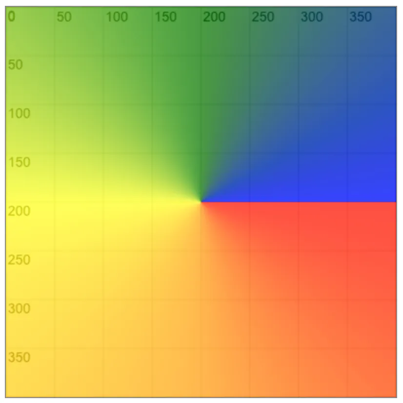
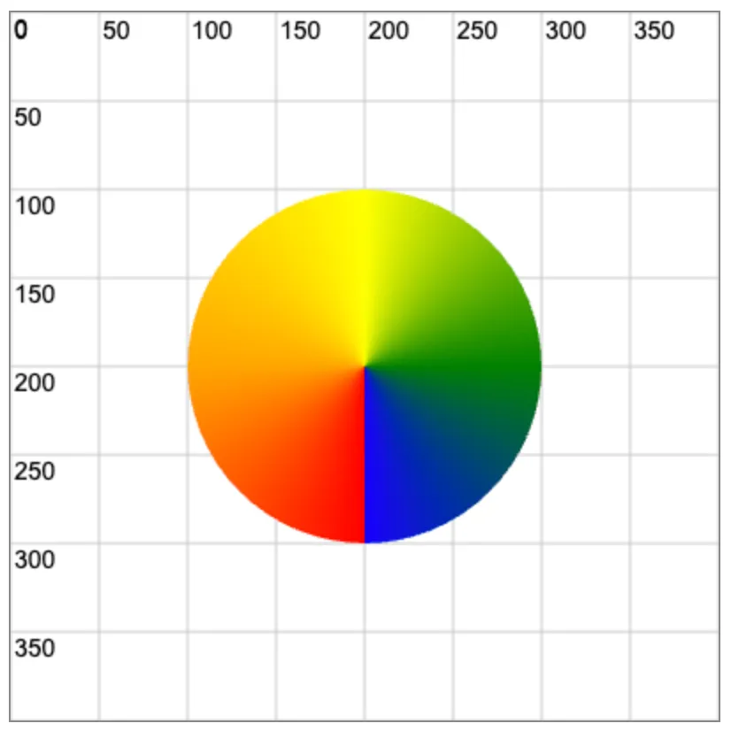
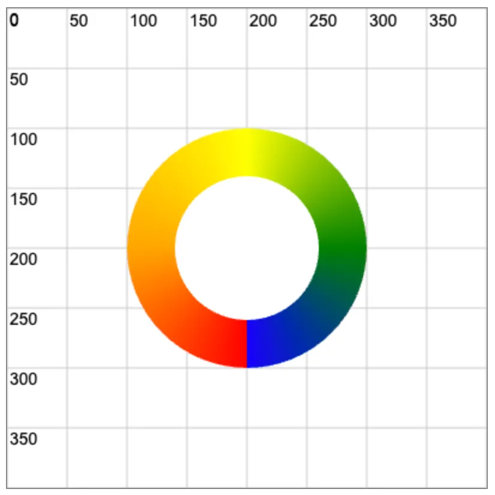

# [0040. 使用 ctx.createConicGradient 实现锥形渐变效果](https://github.com/Tdahuyou/canvas/tree/main/0040.%20%E4%BD%BF%E7%94%A8%20ctx.createConicGradient%20%E5%AE%9E%E7%8E%B0%E9%94%A5%E5%BD%A2%E6%B8%90%E5%8F%98%E6%95%88%E6%9E%9C)

`ctx.createConicGradient(startAngle, x, y)` 用于创建一个锥形渐变。
- `startAngle` 渐变的起始角度
- `x, y` 渐变的中心点坐标

## 🔗 links

https://developer.mozilla.org/en-US/docs/Web/API/CanvasRenderingContext2D/createConicGradient - MDN - `ctx.createConicGradient(startAngle, x, y)`。

## 💻 demo1

```html
<!-- 1.html -->
<!DOCTYPE html>
<html lang="en">
  <head>
    <meta charset="UTF-8" />
    <meta http-equiv="X-UA-Compatible" content="IE=edge" />
    <meta name="viewport" content="width=device-width, initial-scale=1.0" />
    <title>Document</title>
    <style>
      canvas {
        border: 1px solid #888;
        margin-right: 5px;
      }
    </style>
  </head>
  <body>
    <script src="./drawGrid.js"></script>
    <script>
      // createConicGradient(startAngle, x, y)
      // startAngle: 渐变的起始角度
      // x, y: 渐变的中心点坐标

      // 渐变的起始角度是 0，也就是 3 点钟方向 🕒。
      // 渐变角度的单位是弧度，而非度。

      const canvas = document.createElement('canvas')
      drawGrid(canvas, 400, 400, 50)
      document.body.append(canvas)
      const ctx = canvas.getContext('2d')

      ctx.beginPath()
      ctx.globalAlpha = 0.8

      const gradient = ctx.createConicGradient(0, 200, 200)
      // 0 表示从 3 点钟方向开始渐变
      // 200 200 表示渐变的中心点坐标

      gradient.addColorStop(0, 'red')
      // 表示渐变的起点颜色为红色
      gradient.addColorStop(0.25, 'orange')
      // 表示渐变到 25% 的位置时的颜色为橙色
      gradient.addColorStop(0.5, 'yellow')
      // 表示渐变到 50% 的位置时的颜色为黄色
      gradient.addColorStop(0.75, 'green')
      // 表示渐变到 75% 的位置时的颜色为绿色
      gradient.addColorStop(1, 'blue')
      // 表示渐变的终点颜色为蓝色

      ctx.fillStyle = gradient

      ctx.rect(0, 0, canvas.width, canvas.height)
      ctx.stroke()
      ctx.fill()
    </script>
  </body>
</html>
```



## 💻 demo2

```html
<!-- 2.html -->
<!DOCTYPE html>
<html lang="en">
  <head>
    <meta charset="UTF-8" />
    <meta http-equiv="X-UA-Compatible" content="IE=edge" />
    <meta name="viewport" content="width=device-width, initial-scale=1.0" />
    <title>Document</title>
    <style>
      canvas {
        border: 1px solid #888;
        margin-right: 5px;
      }
    </style>
  </head>
  <body>
    <script src="./drawGrid.js"></script>
    <script>
      const canvas = document.createElement('canvas')
      drawGrid(canvas, 400, 400, 50)
      document.body.append(canvas)
      const ctx = canvas.getContext('2d')

      ctx.beginPath()

      const gradient = ctx.createConicGradient(Math.PI / 2, 200, 200)
      // Math.PI / 2 表示从 6 点钟方向开始渐变
      // 200 200 表示渐变的中心点坐标

      gradient.addColorStop(0, 'red')
      gradient.addColorStop(0.25, 'orange')
      gradient.addColorStop(0.5, 'yellow')
      gradient.addColorStop(0.75, 'green')
      gradient.addColorStop(1, 'blue')

      ctx.fillStyle = gradient

      ctx.arc(200, 200, 100, 0, Math.PI * 2)
      ctx.fill()
    </script>
  </body>
</html>
```



## 💻 demo3

```html
<!-- 3.html -->
<!DOCTYPE html>
<html lang="en">
  <head>
    <meta charset="UTF-8" />
    <meta http-equiv="X-UA-Compatible" content="IE=edge" />
    <meta name="viewport" content="width=device-width, initial-scale=1.0" />
    <title>Document</title>
    <style>
      canvas {
        border: 1px solid #888;
        margin-right: 5px;
      }
    </style>
  </head>
  <body>
    <script src="./drawGrid.js"></script>
    <script>
      const canvas = document.createElement('canvas')
      drawGrid(canvas, 400, 400, 50)
      document.body.append(canvas)
      const ctx = canvas.getContext('2d')

      ctx.beginPath()

      const gradient = ctx.createConicGradient(Math.PI / 2, 200, 200)

      gradient.addColorStop(0, 'red')
      gradient.addColorStop(0.25, 'orange')
      gradient.addColorStop(0.5, 'yellow')
      gradient.addColorStop(0.75, 'green')
      gradient.addColorStop(1, 'blue')

      ctx.fillStyle = gradient

      ctx.arc(200, 200, 100, 0, Math.PI * 2)
      ctx.fill()

      // 在中间绘制一个白色的圆，实现类似色相环的效果。
      ctx.beginPath()
      ctx.fillStyle = '#fff'
      ctx.arc(200, 200, 60, 0, Math.PI * 2)
      ctx.fill()
    </script>
  </body>
</html>
```


