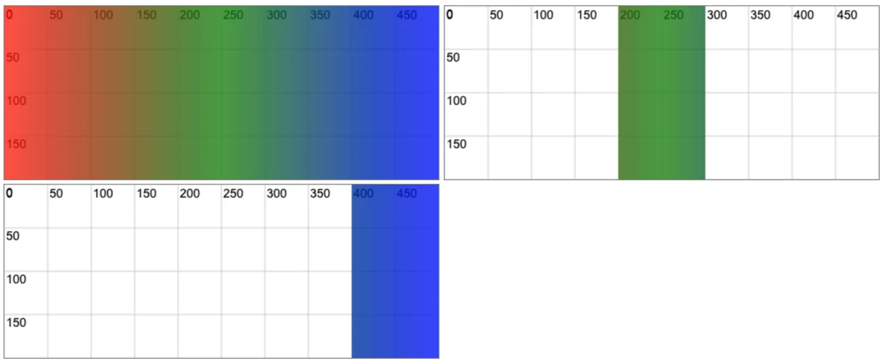

# [0041. 使用 ctx.createLinearGradient 实现线性渐变效果](https://github.com/Tdahuyou/canvas/tree/main/0041.%20%E4%BD%BF%E7%94%A8%20ctx.createLinearGradient%20%E5%AE%9E%E7%8E%B0%E7%BA%BF%E6%80%A7%E6%B8%90%E5%8F%98%E6%95%88%E6%9E%9C)

<!-- region:toc -->
- [1. 📝 Summary](#1--summary)
- [2. 🔗 links](#2--links)
- [3. 💻 demo1](#3--demo1)
- [4. 💻 demo2](#4--demo2)
<!-- endregion:toc -->

## 1. 📝 Summary

- `createLinearGradient(x0, y0, x1, y1)` 它设置的仅仅是线性渐变的区域。

## 2. 🔗 links

- https://developer.mozilla.org/en-US/docs/Web/API/CanvasRenderingContext2D/createLinearGradient - MDN - `ctx.createLinearGradient`。

## 3. 💻 demo1

```html
<!-- 1.html -->
<!DOCTYPE html>
<html lang="en">
  <head>
    <meta charset="UTF-8" />
    <meta http-equiv="X-UA-Compatible" content="IE=edge" />
    <meta name="viewport" content="width=device-width, initial-scale=1.0" />
    <title>Document</title>
    <style>
      canvas {
        border: 1px solid #888;
        margin-right: 5px;
      }
    </style>
  </head>
  <body>
    <script src="./drawGrid.js"></script>
    <script>
      // ctx.createLinearGradient 方法是 Canvas API 中用于创建线性渐变对象的函数。

      // 接受四个参数：x0, y0, x1, y1
      // 分别代表渐变的起点 (x0, y0) 和终点 (x1, y1) 的坐标。
      // 会按照两点的连线方向渐变。
      // 可以是横向、纵向、斜向。

      // 注意：
      // 渐变的参考系是画布坐标系。
      // 位置不会随着图形的变化而变化。
      {
        const canvas = document.createElement('canvas')
        drawGrid(canvas, 500, 200, 50)
        document.body.append(canvas)
        const ctx = canvas.getContext('2d')

        ctx.globalAlpha = 0.8

        const gradient = ctx.createLinearGradient(0, 0, canvas.width, 0)
        gradient.addColorStop(0, 'red') // 表示渐变的起点颜色为红色
        gradient.addColorStop(0.5, 'green') // 表示渐变的中间（50% 位置）颜色为绿色
        gradient.addColorStop(1, 'blue') // 表示渐变的终点颜色为蓝色

        ctx.fillStyle = gradient
        ctx.fillRect(0, 0, canvas.width, canvas.height)
      }

      // 仅修改矩形的尺寸和位置观察渐变效果。
      // 会发现渐变是固定的，矩形位置和尺寸仅仅决定了展示哪一部分的渐变效果。
      {
        const canvas = document.createElement('canvas')
        drawGrid(canvas, 500, 200, 50)
        document.body.append(canvas)
        const ctx = canvas.getContext('2d')

        ctx.globalAlpha = 0.8

        const gradient = ctx.createLinearGradient(0, 0, canvas.width, 0)
        gradient.addColorStop(0, 'red')
        gradient.addColorStop(0.5, 'green')
        gradient.addColorStop(1, 'blue')

        ctx.fillStyle = gradient
        ctx.fillRect(200, 0, 100, canvas.height)
      }

      {
        const canvas = document.createElement('canvas')
        drawGrid(canvas, 500, 200, 50)
        document.body.append(canvas)
        const ctx = canvas.getContext('2d')

        ctx.globalAlpha = 0.8

        const gradient = ctx.createLinearGradient(0, 0, canvas.width, 0)
        gradient.addColorStop(0, 'red')
        gradient.addColorStop(0.5, 'green')
        gradient.addColorStop(1, 'blue')

        ctx.fillStyle = gradient
        ctx.fillRect(400, 0, 100, canvas.height)
      }

    </script>
  </body>
</html>
```



## 4. 💻 demo2

```html
<!-- 2.html -->
<!DOCTYPE html>
<html lang="en">
  <head>
    <meta charset="UTF-8" />
    <meta http-equiv="X-UA-Compatible" content="IE=edge" />
    <meta name="viewport" content="width=device-width, initial-scale=1.0" />
    <title>Document</title>
  </head>
  <body>
    <script src="./drawGrid.js"></script>
    <script>
      // 前面的示例创建的是一个铺满整个 canvas 的渐变效果。
      // 如果渐变区域小于矩形区域的话，那么非渐变区域，将展示渐变的“终点”颜色。
      const canvas = document.createElement('canvas')
      drawGrid(canvas, 500, 200, 50)
      document.body.append(canvas)
      const ctx = canvas.getContext('2d')

      ctx.globalAlpha = 0.8

      // 渐变区域是从 100-400
      const gradient = ctx.createLinearGradient(100, 0, 400, 0)
      gradient.addColorStop(0, 'red')
      gradient.addColorStop(0.5, 'green')
      gradient.addColorStop(1, 'blue')

      // 绘制的矩形是从 0-500
      ctx.fillStyle = gradient
      ctx.fillRect(0, 0, canvas.width, canvas.height)

      // 仔细观察最终效果，会发现 0-100 和 400-500 的区域是渐变的“终点”颜色。
      // 这部分是没有渐变效果的。
    </script>
  </body>
</html>
```


