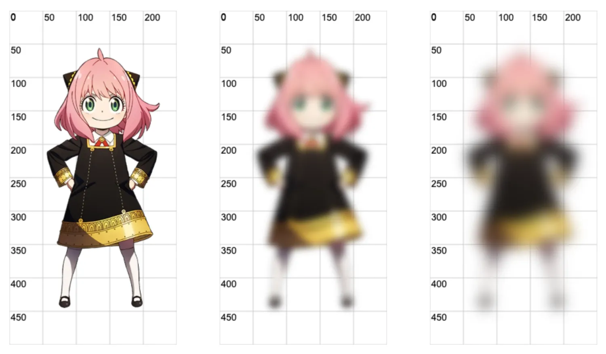
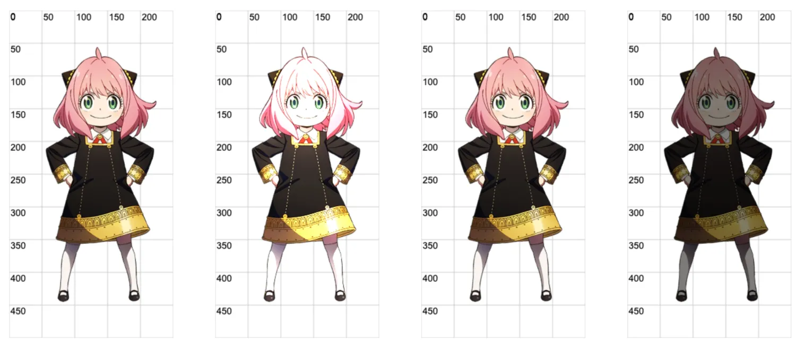
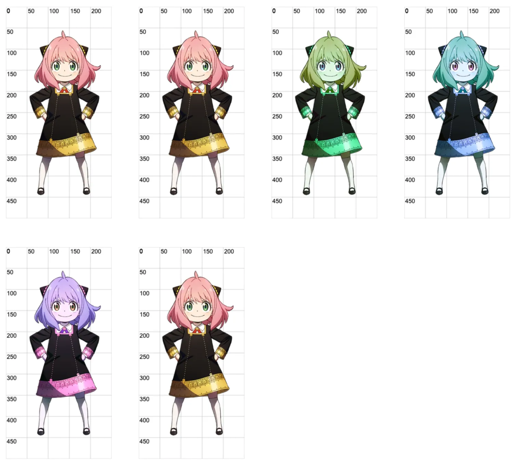
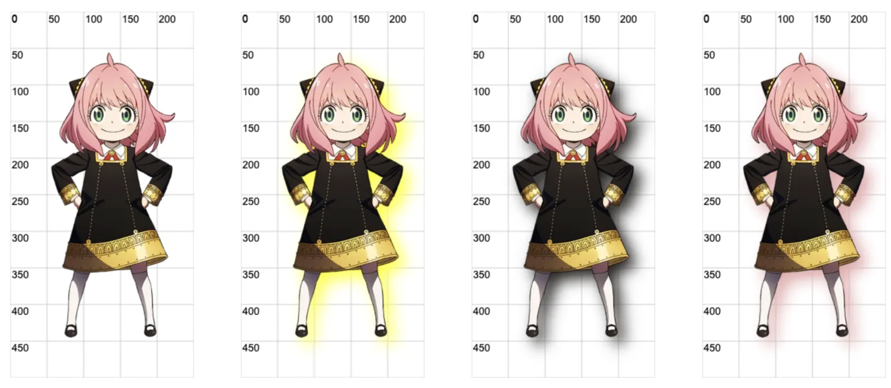
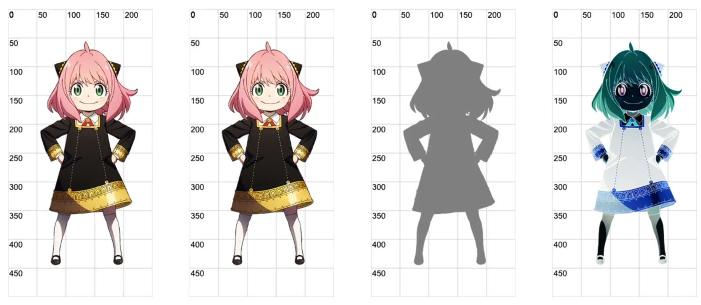
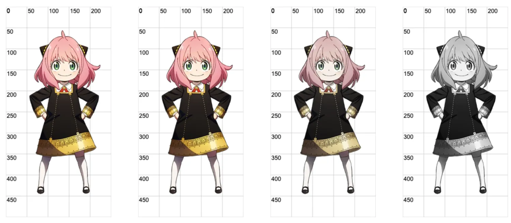
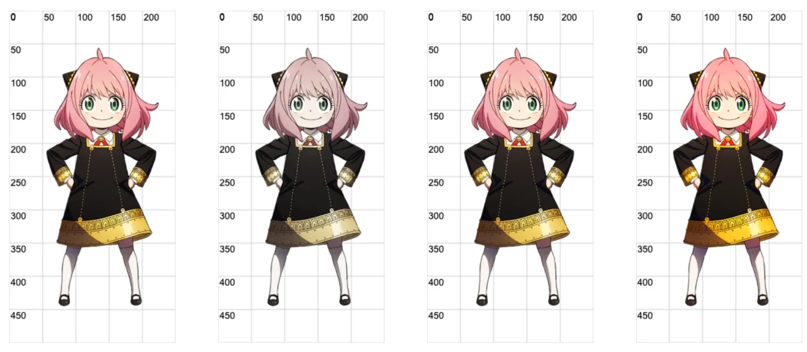
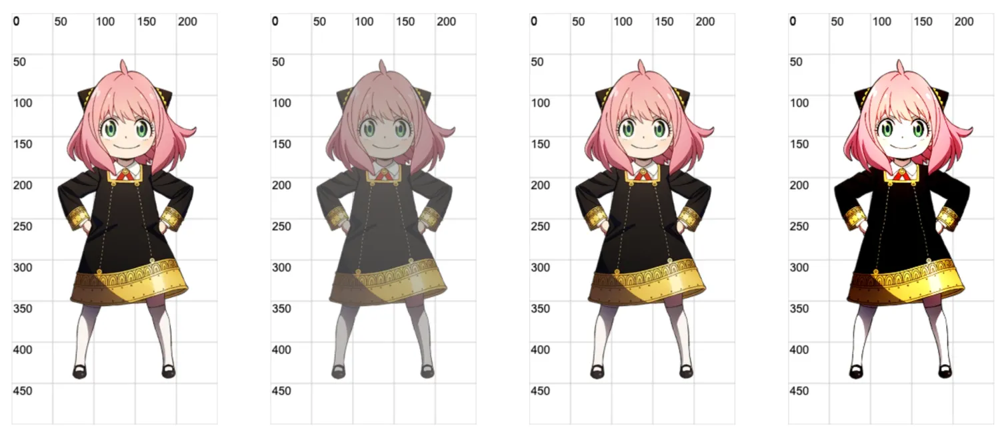
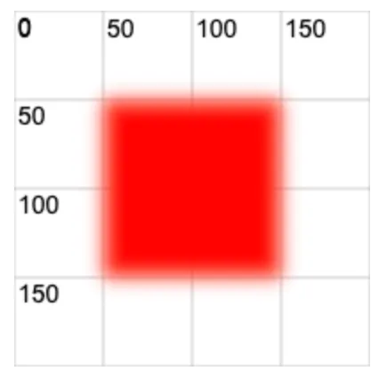

# [0044. 使用 ctx.filter 实现滤镜效果](https://github.com/Tdahuyou/canvas/tree/main/0044.%20%E4%BD%BF%E7%94%A8%20ctx.filter%20%E5%AE%9E%E7%8E%B0%E6%BB%A4%E9%95%9C%E6%95%88%E6%9E%9C)

<!-- region:toc -->

<!-- endregion:toc -->

## 1. 📝 Summary

文档对 ctx.filter 实现滤镜效果做了个简述，快速过了一遍和滤镜相关的部分内容。
陌生的单词有些多…… 需要理解这些单词的含义。

## 2. 🔗 links

- https://developer.mozilla.org/en-US/docs/Web/API/CanvasRenderingContext2D/filter - MDN - ctx.filter。

## 3. 📒 notes

ctx.filter 用于设置滤镜效果，跟 css 中的滤镜语法、功能都非常类似。

**单词**

- brightness，亮度
- hue，色调
- drop，投影，下投
- invert，反转
- sepia，棕褐色，乌贼墨色
- saturate，饱和度
- contrast，对比度

**准备辅助函数 createCanvas**

```javascript
function createCanvas(filterStr) {
  const canvas = document.createElement('canvas')
  drawGrid(canvas, 250, 500, 50)
  document.body.append(canvas)
  const ctx = canvas.getContext('2d')

  ctx.beginPath()

  if (filterStr) {
    ctx.filter = filterStr
  }

  const img = new Image()
  img.src = './安妮娅.png'
  img.onload = function () {
    ctx.drawImage(img, 50, 50)
  }
}
```

## 4. 💻 demo1 - blur

```html
<!DOCTYPE html>
<html lang="en">
  <head>
    <meta charset="UTF-8" />
    <meta http-equiv="X-UA-Compatible" content="IE=edge" />
    <meta name="viewport" content="width=device-width, initial-scale=1.0" />
    <title>Document</title>
    <style>
      canvas {
        margin: 2rem;
      }
    </style>
  </head>
  <body>
    <script src="./drawGrid.js"></script>
    <script src="./createCanvas.js"></script>
    <script>
      // 原图
      createCanvas()

      // ctx.filter = 'blur(5px)'
      // 设置模糊，值越大，模糊效果越明显。
      createCanvas('blur(5px)')
      createCanvas('blur(10px)')
    </script>
  </body>
</html>
```



## 5. 💻 demo2 - brightness

```html
<!DOCTYPE html>
<html lang="en">
  <head>
    <meta charset="UTF-8" />
    <meta http-equiv="X-UA-Compatible" content="IE=edge" />
    <meta name="viewport" content="width=device-width, initial-scale=1.0" />
    <title>Document</title>
    <style>
      canvas {
        margin: 2rem;
      }
    </style>
  </head>
  <body>
    <script src="./drawGrid.js"></script>
    <script src="./createCanvas.js"></script>
    <script>
      // 原图
      createCanvas()

      // ctx.filter = 'brightness(1.5)'
      // 设置亮度
      // 1 表示原样
      // < 1 变暗
      // > 1 变亮
      createCanvas('brightness(1.5)')
      createCanvas('brightness(1)')
      createCanvas('brightness(0.5)')
    </script>
  </body>
</html>
```



## 6. 💻 demo3 - hue-rotate

```html
<!DOCTYPE html>
<html lang="en">
  <head>
    <meta charset="UTF-8" />
    <meta http-equiv="X-UA-Compatible" content="IE=edge" />
    <meta name="viewport" content="width=device-width, initial-scale=1.0" />
    <title>Document</title>
    <style>
      canvas {
        margin: 2rem;
      }
    </style>
  </head>
  <body>
    <script src="./drawGrid.js"></script>
    <script src="./createCanvas.js"></script>
    <script>
      // 原图
      createCanvas()

      // ctx.filter = 'hue-rotate(180deg)'
      // 用于设置色调
      // 参数表示色调旋转的角度。
      // 角度可以是从 0deg 到 360deg。
      // 其中 0deg 表示不进行色调改变，360deg 表示完全旋转一圈，效果同 0deg。
      // 不同的角度值会将颜色沿着色彩环移动，产生不同的视觉效果。
      createCanvas('hue-rotate(0deg)')
      createCanvas('hue-rotate(90deg)')
      createCanvas('hue-rotate(180deg)')
      createCanvas('hue-rotate(270deg)')
      createCanvas('hue-rotate(360deg)')
    </script>
  </body>
</html>
```



## 7. 💻 demo4 - drop-shadow


```html
<!DOCTYPE html>
<html lang="en">
  <head>
    <meta charset="UTF-8" />
    <meta http-equiv="X-UA-Compatible" content="IE=edge" />
    <meta name="viewport" content="width=device-width, initial-scale=1.0" />
    <title>Document</title>
    <style>
      canvas {
        margin: 2rem;
      }
    </style>
  </head>
  <body>
    <script src="./drawGrid.js"></script>
    <script src="./createCanvas.js"></script>
    <script>
      // 原图
      createCanvas()

      // ctx.filter = 'drop-shadow(x y blur color)'
      // x - 阴影在水平方向上的偏移量，可以是正值或负值。
      // y - 阴影在垂直方向上的偏移量，可以是正值或负值。
      // blur - 模糊半径，定义阴影的软化程度。数值越大，阴影越模糊和扩散。
      // color - 阴影的颜色。
      createCanvas('drop-shadow(10px 10px 10px yellow)')
      createCanvas('drop-shadow(10px 10px 10px #231f1d)')
      createCanvas('drop-shadow(10px 10px 10px #e4a5a8)')
    </script>
  </body>
</html>
```



## 8. 💻 demo5 - invert

```html
<!DOCTYPE html>
<html lang="en">
  <head>
    <meta charset="UTF-8" />
    <meta http-equiv="X-UA-Compatible" content="IE=edge" />
    <meta name="viewport" content="width=device-width, initial-scale=1.0" />
    <title>Document</title>
    <style>
      canvas {
        margin: 2rem;
      }
    </style>
  </head>
  <body>
    <script src="./drawGrid.js"></script>
    <script src="./createCanvas.js"></script>
    <script>
      // 原图
      createCanvas()

      // ctx.filter = 'invert(1)'

      // 该函数将所有颜色的值反转，例如黑变白，白变黑，以及其他颜色的相对反色。
      // 这种滤镜可以创建具有强烈视觉对比效果的图像，常用于特殊视觉效果或辅助功能（比如夜间模式或视觉障碍模式）。

      // 设置反色
      // 0   表示原样
      // 0.5 表示灰色
      // 1   表示颜色取反
      createCanvas('invert(0)')
      createCanvas('invert(0.5)')
      createCanvas('invert(1)')
    </script>
  </body>
</html>
```



## 9. 💻 demo6 - sepia

```html
<!DOCTYPE html>
<html lang="en">
  <head>
    <meta charset="UTF-8" />
    <meta http-equiv="X-UA-Compatible" content="IE=edge" />
    <meta name="viewport" content="width=device-width, initial-scale=1.0" />
    <title>Document</title>
    <style>
      canvas {
        margin: 2rem;
      }
    </style>
  </head>
  <body>
    <script src="./drawGrid.js"></script>
    <script src="./createCanvas.js"></script>
    <script>
      // 原图
      createCanvas()

      // ctx.filter = 'sepia(1)'
      // 用于给图像添加一种深褐色的怀旧效果，类似于早期摄影中使用的棕褐色调。
      // 0 表示原样
      // 1 怀旧风格（深褐色）
      createCanvas('sepia(0)')
      createCanvas('sepia(0.5)')
      createCanvas('sepia(1)')
    </script>
  </body>
</html>
```


## 10. 💻 demo7 - grayscale

```html
<!DOCTYPE html>
<html lang="en">
  <head>
    <meta charset="UTF-8" />
    <meta http-equiv="X-UA-Compatible" content="IE=edge" />
    <meta name="viewport" content="width=device-width, initial-scale=1.0" />
    <title>Document</title>
    <style>
      canvas {
        margin: 2rem;
      }
    </style>
  </head>
  <body>
    <script src="./drawGrid.js"></script>
    <script src="./createCanvas.js"></script>
    <script>
      // 原图
      createCanvas()

      // ctx.filter = 'grayscale()'
      // 设置灰度
      // 取值范围：0～1
      // 当设为 0 时，元素的颜色不发生变化。
      // 当设为 1 时，表示元素完全转为灰色，即彻底灰度化。
      createCanvas('grayscale(0)')
      createCanvas('grayscale(0.5)')
      createCanvas('grayscale(1)')
    </script>
  </body>
</html>
```



## 11. 💻 demo8 - saturate

```html
<!DOCTYPE html>
<html lang="en">
  <head>
    <meta charset="UTF-8" />
    <meta http-equiv="X-UA-Compatible" content="IE=edge" />
    <meta name="viewport" content="width=device-width, initial-scale=1.0" />
    <title>Document</title>
    <style>
      canvas {
        margin: 2rem;
      }
    </style>
  </head>
  <body>
    <script src="./drawGrid.js"></script>
    <script src="./createCanvas.js"></script>
    <script>
      // 原图
      createCanvas()

      // ctx.filter = 'saturate()'
      // 设置饱和度
      // 1 表示原样
      // < 1 图像整体会变灰
      // > 1 图像整体颜色会更鲜明
      createCanvas('saturate(0.5)')
      createCanvas('saturate(1)')
      createCanvas('saturate(1.5)')
    </script>
  </body>
</html>
```



## 12. 💻 demo9 - contrast

```html
<!DOCTYPE html>
<html lang="en">
  <head>
    <meta charset="UTF-8" />
    <meta http-equiv="X-UA-Compatible" content="IE=edge" />
    <meta name="viewport" content="width=device-width, initial-scale=1.0" />
    <title>Document</title>
    <style>
      canvas {
        margin: 2rem;
      }
    </style>
  </head>
  <body>
    <script src="./drawGrid.js"></script>
    <script src="./createCanvas.js"></script>
    <script>
      // 原图
      createCanvas()

      // ctx.filter = 'contrast()'
      // 设置对比度
      // 1 表示原样
      // < 1 对比度减弱，图像各部分颜色更加接近
      // > 1 对比度增强，颜色更鲜明
      createCanvas('contrast(0.5)')
      createCanvas('contrast(1)')
      createCanvas('contrast(1.5)')
    </script>
  </body>
</html>
```



## 13. 💻 demo10 - 使用 url 引用 svg 滤镜

```html
<!DOCTYPE html>
<html lang="en">
  <head>
    <meta charset="UTF-8" />
    <title>Canvas Using SVG Filter</title>
  </head>
  <body>
    <svg width="0" height="0">
      <!-- 定义一个 svg 滤镜 -->
      <defs>
        <filter id="blur-filter">
          <feGaussianBlur in="SourceGraphic" stdDeviation="5"></feGaussianBlur>
        </filter>
      </defs>
    </svg>


    <script src="./drawGrid.js"></script>
    <script>
      const canvas = document.createElement('canvas')
      drawGrid(canvas, 200, 200, 50)
      document.body.appendChild(canvas)
      const ctx = canvas.getContext('2d')

      // 引用 svg 滤镜。
      ctx.filter = 'url(#blur-filter)'

      // 绘制一个矩形
      ctx.fillStyle = 'red'
      ctx.fillRect(50, 50, 100, 100)
    </script>
  </body>
</html>
```


