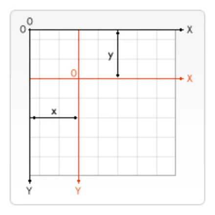
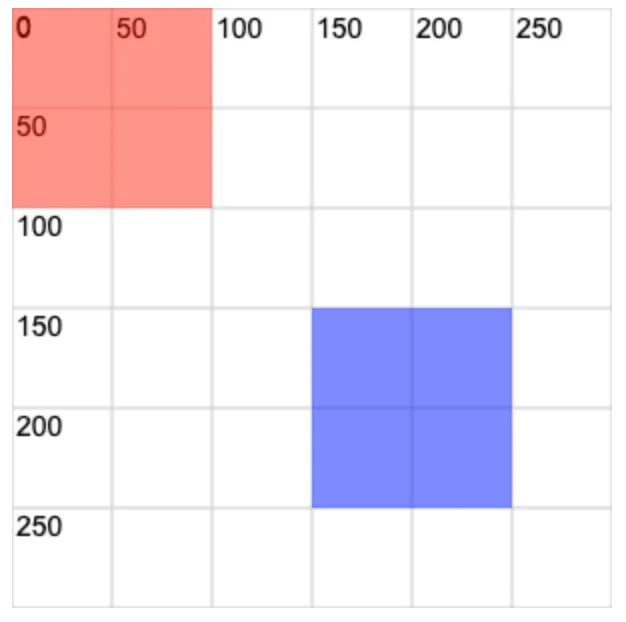

# [0048. 使用 ctx.translate 移动画布](https://github.com/Tdahuyou/canvas/tree/main/0048.%20%E4%BD%BF%E7%94%A8%20ctx.translate%20%E7%A7%BB%E5%8A%A8%E7%94%BB%E5%B8%83)

<!-- region:toc -->
- [1. 📝 Summary](#1--summary)
- [2. 🔗 links](#2--links)
- [3. 📒 notes](#3--notes)
- [4. 💻 demo1](#4--demo1)
<!-- endregion:toc -->

## 1. 📝 Summary

ctx.translate 用于移动画布和其原点到一个新的位置。

## 2. 🔗 links

- https://developer.mozilla.org/en-US/docs/Web/API/CanvasRenderingContext2D/translate - MDN - CanvasRenderingContext2D：translate() 方法

## 3. 📒 notes

ctx.translate 用于移动画布和其原点到一个新的位置。

**注意：**
1. 这玩意儿移动的是整个坐标系，而非指定的某个图像。
2. 这种变换是对后续的所有画布绘制操作起作用的，而不会影响已经绘制到画布上的内容。



## 4. 💻 demo1

```html
<!-- 1.html -->
<!DOCTYPE html>
<html lang="en">
  <head>
    <meta charset="UTF-8" />
    <meta http-equiv="X-UA-Compatible" content="IE=edge" />
    <meta name="viewport" content="width=device-width, initial-scale=1.0" />
    <title>Document</title>
  </head>
  <body>
    <script src="./drawGrid.js"></script>
    <script>
      // ctx.translate 用于移动画布和其原点到一个新的位置。

      // 注意：
      // 1. 这玩意儿移动的是整个坐标系，而非指定的某个图像。
      // 2. 这种变换是对后续的所有画布绘制操作起作用的，而不会影响已经绘制到画布上的内容。
      const canvas = document.createElement('canvas')
      drawGrid(canvas, 300, 300, 50)
      document.body.append(canvas)
      const ctx = canvas.getContext('2d')

      ctx.beginPath()
      ctx.globalAlpha = 0.5

      // 原始绘制
      ctx.fillStyle = 'red'
      ctx.fillRect(0, 0, 100, 100)
      // 在 (0, 0) 处绘制一个红色矩形，矩形尺寸为 100x100。

      ctx.translate(150, 150)
      // 移动坐标原点到 (150, 150)
      // 这一操作，仅会对后续绘制的图像起作用，而不会影响已经绘制到画布上的内容。

      // 在新的坐标原点绘制蓝色矩形
      ctx.fillStyle = 'blue'
      ctx.fillRect(0, 0, 100, 100)
      // 在 (0, 0) 处绘制一个蓝色矩形，矩形尺寸为 100x100。

      // 两次绘制矩形的位置都是 (0, 0)，但是由于坐标原点的不同，导致了两次绘制的位置不同。
    </script>
  </body>
</html>
```


