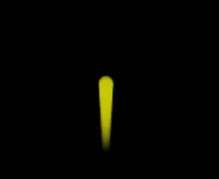
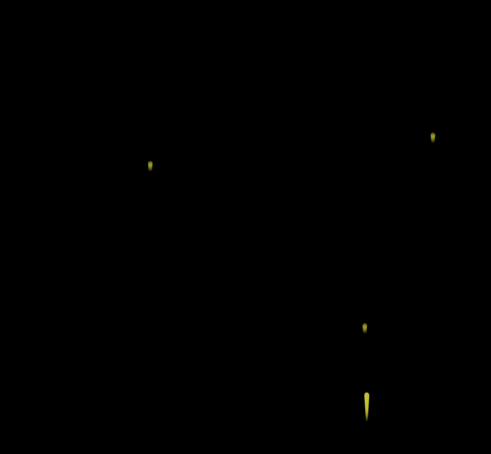

# 0049. 模拟烟花效果

理解文档中提到的烟花效果的实现原理。

本节仅仅是实现一个非常简易版本的烟花的可视化效果，最终要实现的烟花效果，重点有两个：
- 烟花的上升过程。
- 烟花的爆炸过程。

## 📝 notes - 烟花 - 最终效果


## 📝 notes - 烟花 - 上升过程分析

- 把烟花模拟成一个黄色的圆。
- 每间隔 50 帧，放一个烟花。
- 页面上烟花数量的上限为 5 个。
  - 第 n 个烟花出现，意味着第 n - 5 爆炸。
  - 爆炸后的烟花意味着消失。
- 烟花上升的速度是一个随机值。
- 烟花上升的过程中有尾迹效果，类似一个水滴 💧 形状。
  - 大圆在上，小尖尖在下。
  - 从大圆到小尖尖，亮度不断降低。



- 烟花上升过程中，透明度不断地降低。

## 💻 demo - 实现上升过程

```html
<!-- index.html -->
<!DOCTYPE html>
<html lang="en">
  <head>
    <meta charset="UTF-8" />
    <meta http-equiv="X-UA-Compatible" content="IE=edge" />
    <meta name="viewport" content="width=device-width, initial-scale=1.0" />
    <title>Document</title>
    <link rel="stylesheet" href="index.css" />
  </head>
  <body>
    <script src="index.js"></script>
  </body>
</html>
```

```css
/* index.css */
html,
body {
  margin: 0;
  padding: 0;
}

canvas {
  background-color: black;
}
```

```js
// index.js
const canvas = document.createElement('canvas')
document.body.append(canvas)
canvas.width = window.innerWidth
canvas.height = window.innerHeight
const ctx = canvas.getContext('2d')

ctx.translate(0, canvas.height)

ctx.scale(1, -1)
// y 轴反转
// y 值变大的过程，就是上升的过程。

// Firework 用于创建和管理烟花
class Firework {
  constructor(x, y) {
    this.x = x
    this.y = y
    this.r = 6
    this.opacity = 1 // 初始不透明度
    this.speed = 2 + Math.random() * 4 // 随机上升速度
    Firework.activeFireworks.push(this)
  }

  static activeFireworks = [] // 存储所有正在活动的烟花
  static maxActiveCount = 5 // 最大同时活动的烟花数量

  draw() {
    // 绘制多个小球，形成烟花主体形状。
    // 类似于水滴的效果 💧
    // 大的圆在上面，小的尖尖在下面，看起来像是一个小尾巴的效果。
    this.y += this.speed
    this.opacity = Math.max(this.opacity - 0.01, 0.2)
    for (let i = 0; i < 100; i++) {
      const ball = new Ball(
        this.x,
        this.y - i,
        this.r - i / 20,
        `rgba(200,200,50,${this.opacity - i / 100})`
      )
      ball.draw()
    }
  }

  static update() {
    if (this.activeFireworks.length == this.maxActiveCount)
      this.activeFireworks.shift()

    this.activeFireworks.forEach(fire => fire.draw())
  }
}

// Ball 用于绘制烟花升空过程中的球形效果。
// 每个球有位置、半径和颜色。
class Ball {
  constructor(x, y, r, color) {
    this.x = x
    this.y = y
    this.r = r
    this.color = color
  }
  draw() {
    ctx.save()
    ctx.beginPath()
    ctx.fillStyle = this.color
    ctx.arc(this.x, this.y, this.r, 0, Math.PI * 2)
    ctx.fill()
    ctx.restore()
  }
}

let frameCount = 0
function animate() {
  ctx.clearRect(0, 0, canvas.width, canvas.height)

  // 每 50 帧，释放一个新的烟花。
  if (frameCount % 50 == 0) {
    const x = (Math.random() * canvas.width * 3) / 4 + canvas.width / 8
    // 烟花释放的横坐标，限制在画布的 1/8 ~ 7/8 之间。

    const y = Math.random() * 100
    // 烟花释放的纵坐标，限制在 0～100 之间。

    new Firework(x, y)
  }

  Firework.update()

  frameCount++
  requestAnimationFrame(animate)
}
animate()
```



## 📝 notes - 烟花 - 爆炸过程分析

**烟花的爆炸原理分析：**
爆炸后的烟花，本质上就是绘制若干个小球，小球的数量由 `this.particleCount` 变量来表示。所有爆炸的粒子实例存储在 `this.particles` 数组中，每次更新烟花 `Firework.update()` 的时候需要去绘制俩玩意儿：
1. 还没爆炸的烟花 `Firework.activeFireworks`
2. 已经爆炸的烟花 `Firework.explodeFireworks`
还没爆炸的烟花，绘制逻辑就是前面提到的烟花上升逻辑，保持不变即可。
爆炸后的烟花，需要将烟花实例存储到 `Firework.explodeFireworks` 中，然后遍历所有已经爆炸的烟花实例，创建爆炸粒子、更新爆炸粒子的状态。

## 💻 demo - 实现爆炸过程

html、css 保持不变，主要扩展 index.js 文件。

```js
const canvas = document.createElement('canvas')
document.body.append(canvas)
canvas.width = window.innerWidth
canvas.height = window.innerHeight
const ctx = canvas.getContext('2d')

ctx.translate(0, canvas.height)

ctx.scale(1, -1)

class Firework {
  constructor(x, y) {
    this.x = x
    this.y = y
    this.r = 6
    this.opacity = 1
    this.speed = 2 + Math.random() * 4
    this.particleCount = 100 // 爆炸的粒子数量
    this.particles = [] // 存储爆炸后的粒子
    Firework.activeFireworks.push(this)
  }

  static activeFireworks = []
  static explodeFireworks = []
  static maxActiveCount = 5
  // static maxExplodeCount = 5

  static update() {
    if (this.activeFireworks.length == this.maxActiveCount) {
      const explodeFireword = this.activeFireworks.shift()
      this.explodeFireworks.push(explodeFireword)
    }

    // if (this.explodeFireworks.length == this.maxExplodeCount) {
    //   this.explodeFireworks.shift()
    // }

    this.activeFireworks.forEach((fire) => fire.draw())
    this.explodeFireworks.forEach((fire) => fire.explode())
  }

  draw() {
    this.y += this.speed
    this.opacity = Math.max(this.opacity - 0.01, 0.2)
    for (let i = 0; i < 100; i++) {
      const ball = new Ball(
        this.x,
        this.y - i,
        this.r - i / 20,
        `rgba(200,200,50,${this.opacity - i / 100})`
      )
      ball.draw()
    }
  }

  explode() {
    // 绘制爆炸的粒子
    if (this.particles.length == 0) {
      // 首次爆炸
      const angleDelta = (Math.PI * 2) / this.particleCount
      const color = `hsl(${Math.random() * 360},50%,50%)`
      for (let i = 0; i < this.particleCount; i++) {
        const directionX = Math.cos(angleDelta * i) * Math.random() * 4
        const directionY = Math.sin(angleDelta * i) * Math.random() * 4
        const particle = new Particle(
          this.x,
          this.y,
          directionX,
          directionY,
          color
        )
        this.particles.push(particle)
        particle.draw()
      }
    } else {
      // 已经爆炸，产生了粒子，重绘粒子即可
      this.particles.forEach((particle) => particle.update())
      this.particles = this.particles.filter((particle) => particle.isActive())
    }
  }
}

class Ball {
  constructor(x, y, r, color) {
    this.x = x
    this.y = y
    this.r = r
    this.color = color
  }
  draw() {
    ctx.save()
    ctx.beginPath()
    ctx.fillStyle = this.color
    ctx.arc(this.x, this.y, this.r, 0, Math.PI * 2)
    ctx.fill()
    ctx.restore()
  }
}

// Particle 用于绘制爆炸后的粒子效果。
// 每个粒子有位置、方向、颜色和类型（用于控制绘制与否）。
class Particle {
  constructor(x, y, dirX, dirY, color) {
    this.x = x
    this.y = y
    this.radius = 3
    this.dirX = dirX
    this.dirY = dirY
    this.color = color
  }

  draw() {
    ctx.save()
    ctx.beginPath()
    ctx.fillStyle = this.color
    ctx.arc(this.x, this.y, this.radius, 0, Math.PI * 2)
    ctx.fill()
    ctx.restore()
  }

  update() {
    this.x += this.dirX
    this.y += this.dirY
    this.dirX *= 0.98
    this.dirY *= 0.99
    this.draw()
  }

  isActive() {
    return Math.abs(this.dirX) > 0.2 || Math.abs(this.dirY) > 0.2
  }
}

let frameCount = 0
function animate() {
  ctx.clearRect(0, 0, canvas.width, canvas.height)

  if (frameCount % 50 == 0) {
    const x = (Math.random() * canvas.width * 3) / 4 + canvas.width / 8

    const y = Math.random() * 100

    new Firework(x, y)
  }

  Firework.update()

  frameCount++
  requestAnimationFrame(animate)
}
animate()
```

上述的高亮区域是主要修改的内容，index.html、index.css 中的内容是没有发生变化的。

主要加了一个粒子类，用于创建爆炸后的烟花的粒子实例。


